<div align="center">

<!-- width=840 is the card's real CSS width from scripts/render-hero.py; it renders 1:1.
     The five drawio figures in the body use width=100%; this one deliberately does not.
     After editing src/logo.ts, re-run: python scripts/render-hero.py -->


**Highlight a passage in your own notes, and get questioned**

[中文](README.md) · **English**


</div>

---

> Highlight a passage in Obsidian. Someone sits in the sidebar and, instead of answering,
> asks you a question first.
>
> He holds exactly two tools: **read your note** and **edit your note**. He must read before
> he may edit, and even then he can only *propose* — nothing touches the disk until you click **Allow**.
>
> He runs on your own machine. **There is no server owned by the author.**

**Contents**

[Why this exists](#1--why-this-exists) ·
[What it actually does](#2--what-it-actually-does-in-30-seconds) ·
[Features, one real example each](#3--features-one-real-example-each) ·
[System design](#4--system-design) ·
[Install · Use · Privacy](#5--install--use--privacy) ·
[Development](#6--development--tests--license) ·
[Future Works](#7--future-works)

---

## 1 · Why this exists

Socrates is an Obsidian plugin. Highlight a passage in a note and the sidebar takes that passage as
its topic; when the conversation lands on something worth keeping, it can write the result back
into the note. It takes exactly one situation seriously: one person working through one long
handbook, where the book is thick, the author is not in the room, and you are the only reader.
Capturing ideas and polishing prose are not what it is for.

The book it started from is **13,083 lines and 626 KB**, written by one person and read by exactly
one. Skimming a book like that buys you nothing: every level rests on the conclusions of the one
before it, and a single line in Level 7 ("so this has to read first") has its reasoning buried
three layers deep inside a design decision back in Level 2. The hard part was never comprehension —
the hard part is that when you get stuck, **there is nobody to ask**.

A general-purpose chatbot cannot fill that seat. It has not read your book, so when you paste the
passage in you get a competent, generic explanation: correct, and unrelated to the book in your
hands. It does not know how the concept was set up in Level 2, it does not know the author already
rejected a simpler approach in decision ② of Level 4, and it does not know that you asked almost
this exact question three minutes ago.

To fill that seat, this plugin follows the **Socratic method**. Socrates barely lectured: he sat
with the other person and asked about what they had just said, or just read, until they could
see for themselves what they had not thought through. He did not hand over the answer; the questions
drew it out of them. You thought you were keeping up, and one question shows you were not. You do
not have to compose a full explanation; you only have to take that one question, which already
marks the piece worth thinking about.

The method more often recommended for studying alone is the **Feynman technique**. Pick a concept,
explain it in plain language as if to a newcomer, and wherever the explanation dies is where you
do not yet understand; then go back, fill the hole, and explain it again. It runs on output: the
talking has to come from you. It is a good tool once you already have most of it and need to find
the holes. But it has a threshold: you already have to be able to start.

The worst moment in a long handbook sits before that threshold. The material is only half laid down,
the last level has not settled, and you do not even know which piece to "teach." A blank page will
not ask you first. You can do Feynman alone, with a sheet of paper; the Socratic method has always
been missing the person sitting next to you. For a handbook where each level sits on the last, what
you lack is not a podium; it is the person who asks one thing at the point where you stopped. That
much is out of Feynman's reach: you don't have to become the teacher first.

So every design choice here grows out of one sentence: **put someone who has actually read this
book, and knows where you are in it, next to you.** Someone sitting next to you does not open by
handing over the answer. The default chip is called `socratic`, and its whole job is to hold the
answer back and ask you a question instead; a tool that asks by default and a tool that answers by
default are two different tools, because the second one has already done the thinking for you.

Two further promises are kept **in code, not in a prompt**. The model may not edit a passage
unless it genuinely read that file in an earlier turn, and the execution layer keeps that ledger —
claiming to have read it does not count. Sessions, snapshots and the deep-dive ledger, meanwhile,
never leave your machine and no telemetry exists in this repository; once installed, the only call
that goes out is to the model endpoint you configured, and only the first restart after a plugin
upgrade fetches a fresh sidecar. Where each of the two is enforced, line by line, is
[section 4](#4--system-design).

Every example below runs against a different book: *Building DQN from Scratch*, 1,405 lines,
shipped in this repository under [`docs/demo/`](docs/demo/). Import it into your own vault and you
can reproduce every exchange in the next section yourself — this README does not ask you to take a
screenshot's word for it.

---

## 2 · What it actually does, in 30 seconds

A full pass is five steps, and all five happen between your note and the sidebar beside it: no
leaving Obsidian, no terminal, nothing to feed to anyone in advance. The first four only read and
ask. Only the last one touches your disk, and only once you have said so yourself.

1. Highlight a passage in a note.
2. Open the sidebar, click "use current selection" (the command palette has the same command),
   then click a chip (don't give it away / explain to a beginner / examples only), or simply type
   your question.
3. He reads your note first, then answers you — or turns the question back on you.
4. Meanwhile a separate background line (the deep-dive ◆ below) reads elsewhere in the same book,
   assembling deeper questions into a pool and releasing at most one per turn.
5. Want the answer kept in the note? He proposes one edit, and nothing lands on disk until you
   click Allow.

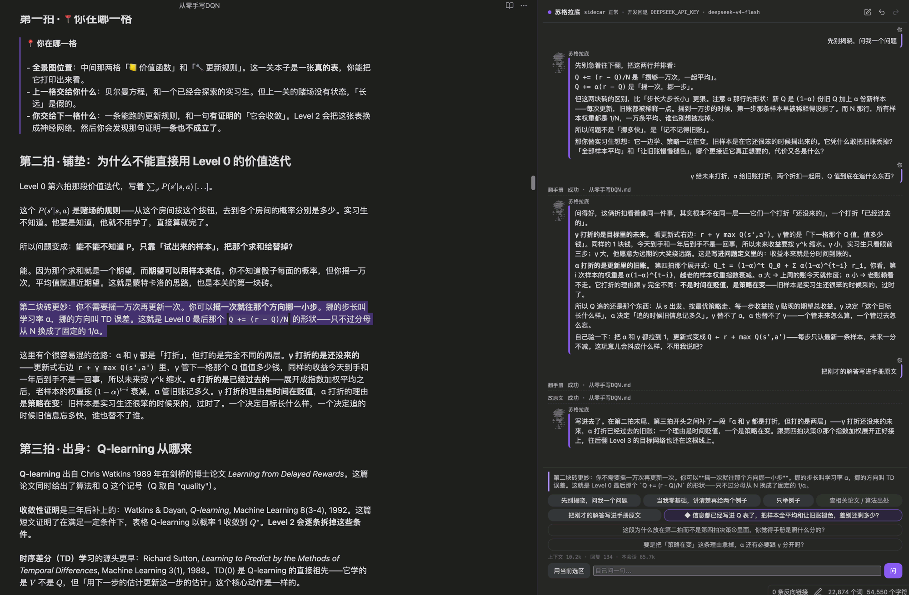

<sup>These interface shots are real runs, not mock-ups. The UI language follows Obsidian's, and
these were taken in Chinese. The chips this README calls *don't give it away*, *explain to a
beginner*, *examples only*, *find the paper* and *write it back* read, in an English interface,
<em>"Don't tell me yet — ask me something"</em>, <em>"Assume I know nothing, then give me two
examples"</em>, <em>"Just show me examples"</em>, <em>"Find the paper / where this came from"</em>
and <em>"Write that answer back into the manual"</em>. The status line's "dev fallback
DEEPSEEK_API_KEY" only shows when running from a source tree; on a normal install that spot names
the endpoint you filled in on the settings page.</sup>

**It is not equally good on any note.** The main conversation runs against any Markdown, but the
background deep-dive needs anchors in the book, which means the handbook has to follow the
eight-beat format: every level carrying sections like "third beat · origins" and "seventh beat ·
working code". Without them one of the five deep-dive axes dies outright and the other four carry
on. [`docs/demo/从零手写DQN.md`](docs/demo/从零手写DQN.md) is a template you can copy, and
[4.9](#49--handbook-agnostic) explains why the format has to be that one.

---

## 3 · Features, one real example each

**The scene**: you're in Level 3 of *Building DQN from Scratch*, and you've highlighted
**decision ① — "why two networks, one frozen and one updating"** (lines 954–964).
That passage splits the answer into three layers: mathematical, dynamical, engineering.

Every answer below came from **`deepseek/deepseek-v4-flash`** (via an OpenRouter endpoint),
running against an isolated **sidecar** — the small Python service the plugin starts on your machine.
Any OpenAI-compatible Chat Completions endpoint works — **but that one combination is all I actually tested.**

Every transcript below was really captured: raw request bodies and SSE event streams live in
[`docs/demo/transcripts/`](docs/demo/transcripts/), linked under each quote. Exactly one thing was
edited afterwards — the capture environment's temporary absolute paths became `/Users/you/…`
([details](docs/demo/transcripts/README.md)). The two excerpts in [3.7](#37--between-two-books) are
the one exception: they come from the author's own local sessions, are full of private vault paths,
and that section's caption says so.

One thing about reading them: the demo handbook is written in Chinese and the model answers in the
language of the book, so the answers quoted below are translations, with the verbatim original one
click away under each. [Future Works](#7--future-works) explains why the language switches.

### 3.1 · Don't give it away — `socratic`

**The default chip.** It reads your selection and then **doesn't answer** — it goes looking for
the crack in that passage you haven't noticed yet.

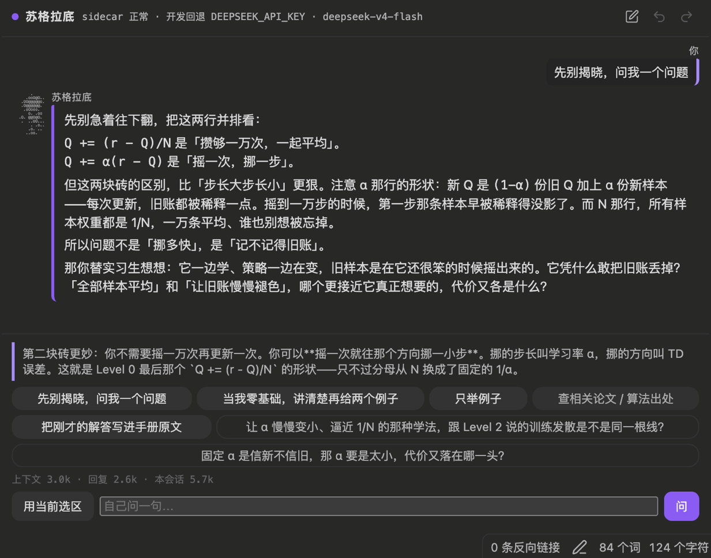

<table><tr><td>

**You**: *(highlight decision ①, click "don't give it away", type nothing)*

</td></tr><tr><td>

**Socrates**:

> You've just read the three-layer breakdown in decision ①. That block really has explained
> "why freeze it" — but there's a crack in it you may or may not have spotted.
>
> The handbook says that once you freeze the target, this turns back into a "standard supervised
> regression problem." Fine. So let me ask you:
>
> **In supervised regression the labels are ground truth, right? But Q_target is still something
> we estimated ourselves — nobody handed it down as the correct answer. So is that phrase
> "turns back into standard supervised regression" hiding an unpaid debt? Who pays it?**

</td></tr></table>

<sup>Raw: [`03-chat-socratic.json`](docs/demo/transcripts/03-chat-socratic.json) · 10.6 s</sup>

"Turns back into standard supervised regression" does slide past something: supervised labels
are given, and this one is estimated.

> **Why this is the default**: a learning tool whose default action is "hand you the answer"
> costs you one act of thinking every time it's used. A default of "ask you a question" has an
> entirely different cost structure.

### 3.2 · Explain to a beginner — `explain_zero`

Same passage, different chip, completely different shape:
**TL;DR → (a) concept contrast → (b) mechanism → (c) counterexample → two runnable examples.**

<details>
<summary><b>Expand the real answer (1,423 chars, 30 s) — translated</b></summary>

> **TL;DR**
>
> **Freezing the target network = nailing RL's moving target to the wall so it becomes ordinary regression.**
> The online network updates every step; the target network is only synced every C steps. Between two
> syncs the target inside the loss is a constant, and the semi-gradient becomes a true gradient.
>
> **(a) Concept contrast: moving vs frozen**
>
> | | Not frozen (Level 2's tabular / function approximation) | Frozen (DQN) |
> |---|---|---|
> | Is θ in the target? | Yes — update the loss and the target moves too | No — target is fixed within C steps |
> | What problem is this | Non-stationary target regression (semi-gradient) | Standard supervised regression (true gradient) |
> | Divergence risk | Positive feedback loop → divergence | Loop severed, connected only for an instant every C steps |
>
> **(c) Counterexample: with C = 1 you froze nothing**
>
> If you set C = 1 (sync after every single update), the target network is forever identical to the
> online one — you froze a whole lot of nothing. You're back at the 2013 version of DQN: no damping,
> loop intact, burning GPU and money for the same behaviour as not freezing at all.
>
> **Two runnable examples**
>
> Both live in the `train()` function of the seventh beat — same function body, different arguments:
>
> **Example 1: standard DQN (C = 200)**
>
> ```python
> # 第七拍里就是这样调的
> returns = train(episodes=400, sync_every=200)
> ```
>
> `sync_every=200` is C. The online network updates 200 times before its weights are copied over to
> `target_net`. For those 200 steps the target is dead still and the gradient is honest. Run it and
> the return curve climbs.
>
> **Example 2: Double DQN (one argument changed)**
>
> ```python
> # 同一份代码，打开 double=True
> returns = train(episodes=400, sync_every=200, double=True)
> ```
>
> The handbook hard-codes the `double` parameter — it changes exactly one line, in the TD target:
> select the action with the online network, evaluate it with the target network. Compare the two
> curves and see whether decoupling selection from evaluation makes it steadier.

</details>

<sup>Raw (Chinese, verbatim): [`04-chat-explain-zero.json`](docs/demo/transcripts/04-chat-explain-zero.json)</sup>

**One constraint here deserves its own paragraph.** The `explain_zero` prompt says the example
names **must match things that actually appear in that Level's seventh beat** — no inventing.
Check all four:

| It wrote | In the book | Where |
| --- | --- | --- |
| `train()` | ✅ | `docs/demo/从零手写DQN.md:1223` |
| `sync_every=200` | ✅ | `:1228` — `sync_every: int = 200,  # ← this is C` |
| `double=True` | ✅ | `:1230` — `double: bool = False,  # turn it on for Double DQN` |
| `if __name__ == "__main__"` | ✅ | `:1292` |

Four for four. That is why the tool reads the book before it answers.

### 3.3 · Just ask — `free`

You type your own question. **Note that it still refuses to simply hand over the answer** —
`socratic` isn't just one chip, it's the tone of the whole prompt.

<table><tr><td>

**You**:

> I'm learning DQN and I don't understand why one Q-network is held fixed while the other updates.
> What makes this converge rather than diverge? Which paper did the idea first come from?
> And how is it proved mathematically that it won't diverge?

</td></tr><tr><td>

**Socrates**:

> Good question — the three of them chain together nicely. I'm not going to dump all of it on you;
> pulling them apart yourself is worth more than hearing me recite.
>
> Start with the part you can look up yourself:
>
> The third beat, "Origins: whose trick is whose," covers exactly which paper target network and
> replay buffer each came from. Go find that passage and see whether the two were introduced by
> the same paper — settle that first.
>
> Then come back to decision ④. It already says it plainly: **nobody has proved that DQN converges.**
> And it separates cleanly what *can* be proved from what can't. Once you've read the whole section,
> try answering this in your own words:
>
> **Decision ④ says there's a gap between DQN and FQI — DQN takes one gradient step per environment
> step and only syncs the target every C steps. If FQI is provably convergent and DQN merely
> *approaches* it, how close is close enough? How large would C have to be before you'd be willing
> to say "fine, that's basically FQI"?**

</td></tr></table>

<sup>Raw (Chinese, verbatim): [`05-chat-free-three-questions.json`](docs/demo/transcripts/05-chat-free-three-questions.json) · 11.0 s</sup>

Three questions, none answered directly — but **all three pinned to exact locations in the book**:
origins in the third beat, convergence in decision ④, and it lifted the single most important
sentence out of decision ④ word for word: *"nobody has proved that DQN converges."*

Ask the same thing again and it does open up
([`14-chat-free-en.json`](docs/demo/transcripts/14-chat-free-en.json)):

> **Second: which paper.**
>
> Turn to the third beat (lines 924–943). There's a crucial distinction: the 2013 workshop paper
> **had no** target network; the 2015 *Nature* paper **added it**. Going further back, Riedmiller's
> 2005 NFQ is the direct ancestor — that one trains a full round before swapping the target,
> and DQN changed it to swapping every C steps.
>
> **Third: is there a proof it won't diverge.**
>
> The conclusion is: **nobody has proved that DQN converges**. But if you push C to the extreme —
> train the regression to completion between syncs — it becomes Fitted Q Iteration, and that has
> a set of error bounds.

Those line numbers, those years, that quotation — all of it came from what it `read_file`'d,
not from its memory.

### 3.4 · Background deep-dive ◆

The **instant** your turn finishes, a separate thread goes off to read *elsewhere in the same book*
and assemble questions you can't ask yet but would ask one step further on, into a pool. It runs
**fully in parallel** with your conversation, so you never wait for it; the pool is not emptied at
you all at once, but released **at most one per turn** (`MAX_RELEASE_PER_TURN = 1`,
`pen/probe_store.py:42`), with at most two hanging in the sidebar at a time.

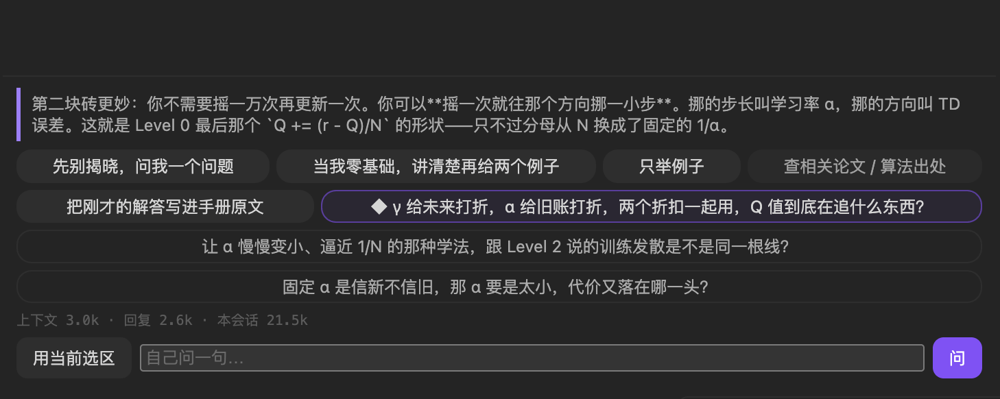

That run put three in the pool. Here is the third:

<table><tr><td>

◆ **Deep dive**

> In Level 2 you learned that divergence needs all three ingredients together. DQN cut the
> *real-time* part out of bootstrapping — so will the remaining two still gang up and blow up on you
> under this structure?

<sup>`axis: altitude` · `depth: 5` · anchors span two levels: **Level 2 (740–747) + Level 3 (954–964)**<br>
(deadly triad: bootstrapping + off-policy + function approximation — all three together can diverge.)</sup>

</td></tr><tr><td>

**Why it raised this one** (the `why` field, filled in by the model itself):

> He has just read the three-layer breakdown of decision ① and is holding Level 2's deadly triad in
> his hand. Make him hook the two levels together — DQN did not kill divergence, it only changed
> that loop from *connected every step* to *connected for an instant every C steps*. The reader
> needs to close this abstraction jump.

</td></tr></table>

<sup>Raw (Chinese, verbatim): [`06b-deep-ledger.json`](docs/demo/transcripts/06b-deep-ledger.json) · 3 items in the pool, 2 calls, 8,043 in / 649 out tokens</sup>

The reader highlighted a passage in Level 3; this question hooks it back to Level 2's deadly triad —
**seven hundred lines earlier**. Its judgement: DQN didn't eliminate any of the triad's three
ingredients, it only lowered the *connection frequency* of one of them from every step to every C steps.

**The gates really do execute questions.** Same passage, English-interface run:
2 calls, 2,002 output tokens, and **not one item survived** — all killed by the `depth < 4` gate
(`pen/probe.py:1001`). One made it through on the second round, in English:

> NFQ trains until convergence before updating the target, while DQN updates every C steps.
> Why doesn't DQN just adopt NFQ's approach for guaranteed convergence?

<sup>Raw: [`13-deep-en.json`](docs/demo/transcripts/13-deep-en.json)</sup>

**Breadth is capped by code, not by the model's self-restraint** — see [4.5 The background deep-dive is a job queue](#45--the-background-deep-dive-is-a-job-queue).

### 3.5 · Writing back, and the approval gate

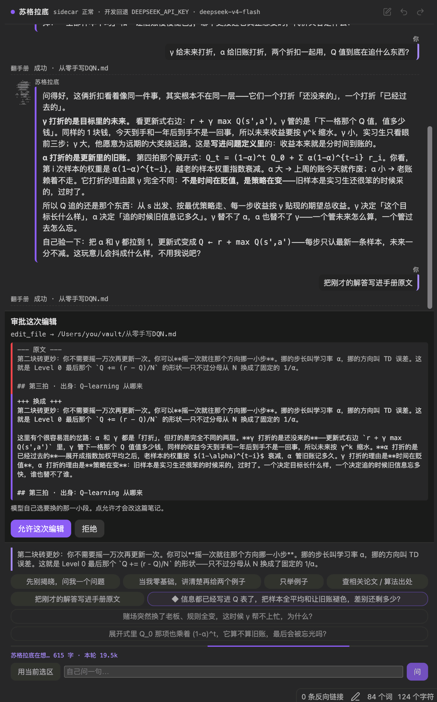

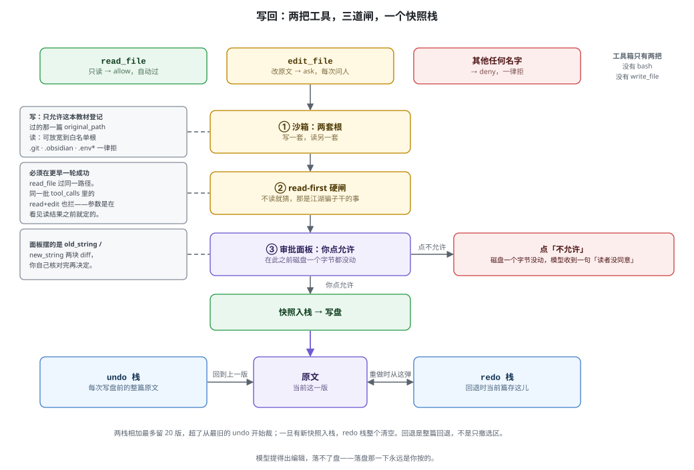

You say: *"take those three layers you just explained about why there are two networks, fold them
into a collapsible block, and put it after decision ①."*

It `read_file`s the passage with line numbers first, and only in the **next turn** proposes a single
edit. The sidebar opens an approval panel with `old_string` / `new_string` side by side.
Translated, the proposal is:

```diff
- This is the core question of the level; here it is in three layers:
+ This is the core question of the level. Below it is broken down on three levels,
+ which you can read in whatever order interests you (click to expand):
+
+ <details>
+ <summary><b>Mathematical · dynamical · engineering — three layers</b></summary>
  ...the three layers, unchanged...
+
+ </details>
```

<sup>Raw (Chinese, verbatim `old_string` / `new_string`): [`07-chat-writeback.json`](docs/demo/transcripts/07-chat-writeback.json)</sup>

**One file, four moments, size and md5:**

| Moment | File size | md5 |
| --- | --- | --- |
| Proposal emitted, approval panel open | 96,874 | `153a8982b0c7…` |
| **After you click Deny** | **96,874** | **`153a8982b0c7…`** |
| After you click Allow | 97,051 | `551363244889…` |
| **After rollback** | **96,874** | **`153a8982b0c7…`** |

While a proposal is pending, **not one byte of the file changes**. Denying changes nothing.
Rolling back restores the original **byte for byte**.

<sup>Raw: [`08b-approve-deny.json`](docs/demo/transcripts/08b-approve-deny.json) (deny) · [`08-approve-allow.json`](docs/demo/transcripts/08-approve-allow.json) (allow) · [`09-snapshots-rollback.json`](docs/demo/transcripts/09-snapshots-rollback.json) (rollback)</sup>

**The permission layer can be verified without involving the model at all** — as it should be:

| Call | Returns |
| --- | --- |
| `decide("read_file")` | `allow` — read-only passes automatically |
| `decide("edit_file")` | `ask` — **every single time** |
| `decide("bash")` / `decide("write_file")` | `deny` — unregistered tools are refused |
| `read_first_block("edit_file", book, read_before=∅)` | ⛔ blocked |
| `read_first_block("edit_file", book, read_before={other file})` | ⛔ blocked |
| `read_first_block("edit_file", book, read_before={book})` | ✅ allowed |

<sup>Raw: [`15-permission-gates.json`](docs/demo/transcripts/15-permission-gates.json) · Source: `pen/agent/permissions.py:15`, `:23`</sup>

### 3.6 · Roll back / redo

The two arrows in the sidebar walk a **snapshot stack**, not the editor's undo history.

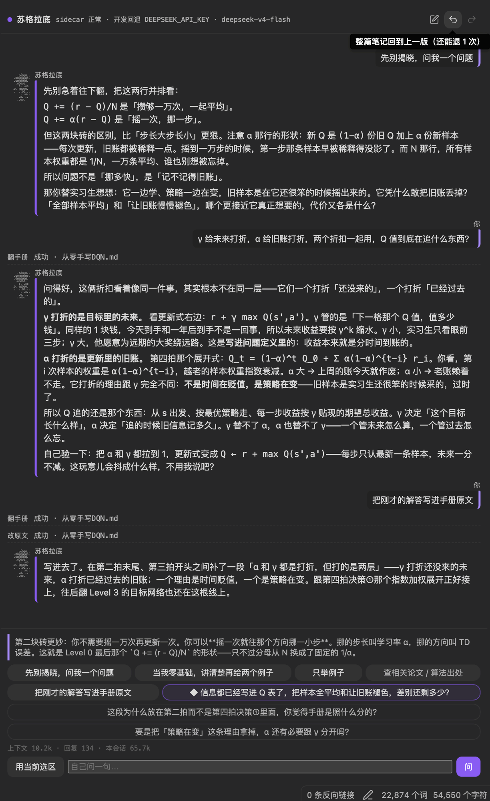

```
GET  /v1/handbooks/dqn-550d425c/snapshots
     → {"can_undo": true, "can_redo": false, "undo_n": 1, "redo_n": 0}

POST /v1/writeback/rollback
     → {"ok": true, "restored_from": ".../snapshots/20260822T015739533075Z-pre-edit.md"}
```

**It restores the whole note, not just your selection.** A proposed edit may touch several places
at once; rolling back by selection would leave you with a half-new, half-old file.

Undo and redo share a budget of **20 versions total** (`pen/config.py:57`, `SNAPSHOT_KEEP = 20`).
That's not an unlimited history — it's enough depth to catch "that last click was a mistake."

### 3.7 · Between two books

When there is more than one book on the shelf, Socrates receives a **summary plus the path** of the
other handbooks, so he can go read one.

The value of that shows up best in a **before/after pair on the same question** — "what's the other
book about?" — asked twice.

**Before the shelf was wired in**, he owned up:

> Good question, but let me be straight with you first: **I haven't read that other Handbook, and
> I'm not going to make something up.**
>
> What I can speak to is the one in my hands. Its name says it — `writeback-fixture.md`, *fixture*,
> a test fixture. Which means this book's real purpose isn't its content, it's **exercising the
> write-back path**.
>
> As for what that *Handbook* actually covers — give me its path and I'll go read it before I answer.
> Guessing without reading is what a con artist does.

**After the shelf was wired in**, same question, he reads first:

> Let me go glance at the opening of that *Handbook* rather than talking from the title.
>
> `read_file` → `1  # Building a SWE Agent by Hand v2 · textbook edition (full: intro + Levels 0–6 + Capstone)` …
>
> Read it. These two aren't one series, they're two different things.
> **The *Handbook* is the main course.** In one sentence: get you from zero to hand-building a
> lightweight SWE Agent… The whole book runs on one metaphor: you're the master, the Agent is an
> intern with zero memory and enormous nerve.

<sup>⚠️ Both come from real sessions on the author's own machine, **not shipped with the repo**
(they contain private vault paths), which makes this the **only** quotation in this document you
cannot verify yourself. Every other quote has its raw JSON linked underneath.</sup>

**Note that the "before" answer is not a failure.** "I haven't read that book" was **correct** —
that was the truth at the time. Which is exactly why the shelf block **disappears entirely** when
there's only one book, rather than printing "(none)": printing "(none)" would confirm on the model's
behalf that no other book exists. That would be lying for it.

One more rule: a title **must** come with a path.

> Give it only a title, and Socrates will just guess at the filename.

That sentence is now the failure message of an assertion in `pen/tests/test_tutor.py`.

### 3.8 · The bill

```
GET /v1/usage
```

```json
{
  "spend": {
    "chat":  {"calls": 14, "in_tokens": 189275, "out_tokens": 9872,
              "cached_tokens": 125440, "reasoning_tokens": 4906},
    "probe": {"calls": 4,  "in_tokens": 15892,  "out_tokens": 6923,
              "cached_tokens": 3328,  "reasoning_tokens": 5674},
    "fold":  {"calls": 0,  "in_tokens": 0, "out_tokens": 0}
  },
  "total": 221962, "sessions": 2, "skipped": 0
}
```


<sup>Raw: [`10-usage.json`](docs/demo/transcripts/10-usage.json) — the actual bill after everything in 3.1–3.6 above</sup>

Three ledgers kept apart: `chat` is the line you're talking to, `probe` is the background deep-dive,
`fold` is the fold generation used by write-back.
**They're separate so they can be capped separately** — a background overrun should never cut off
the turn you're reading right now.

**It counts tokens and does not convert them to money.** The exchange rate is yours: which endpoint,
which model, what discount, whether cache hits are billed — only you know.

You probably still want an order of magnitude. Those 222k tokens, at the price that endpoint was
listing for `deepseek/deepseek-v4-flash` when I ran this ($0.077/M in + $0.154/M out):

```
in 205,167 × $0.077/M  +  out 16,795 × $0.154/M  ≈  $0.018
```

**Under two cents** — and that's an *upper* bound, since it prices 129k cached tokens at full rate.
A frontier model costs one to two orders of magnitude more.

**This total can go down**, and that isn't a bug — sessions expire ([see 4.8](#48--sessions-expire-and-their-bills-go-with-them)),
and when one is purged its bill goes with it.

---

## 4 · System design

### 4.1 · Three processes, one loopback

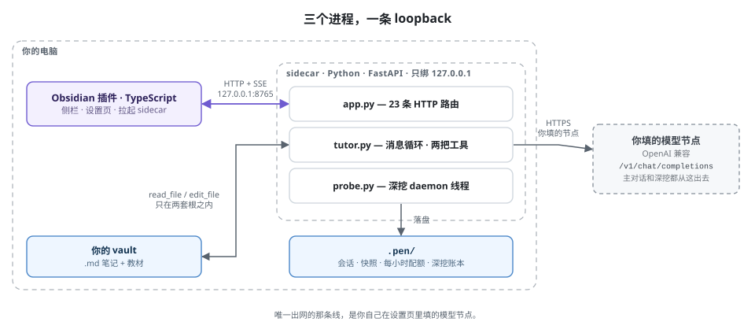

An Obsidian plugin (TypeScript), a local sidecar (Python / FastAPI), and the model endpoint you
configured — three processes, with a loopback between them. The plugin never calls the author's
server and there is no telemetry endpoint in this repository; the sidecar binds `127.0.0.1` only,
and putting a non-local address in settings makes `parseListen` throw `new Error("not-loopback")`
(`src/sidecar.ts:53`) rather than warn.

Model calls leave from your machine, to your endpoint, and any OpenAI-compatible Chat Completions
endpoint works. The other things that leave the machine are install and upgrade: the plugin builds
`~/.socrates-pen/venv` and pip-installs the sidecar from GitHub and PyPI, and after that it's all
local. The upgrade half comes with a condition: on every start the plugin pings the local service
first, and a successful ping means it just attaches and downloads nothing. Only when the ping fails
and the service has to be restarted does it compare versions — and only a stale version fetches a
matching sidecar once more.

### 4.2 · The toolbox holds exactly two tools

The toolbox holds `read_file` and `edit_file`, and nothing else — **no bash, no write_file, no
shell**. Permissions aren't a switch either, they're three-valued: `read_file` is allow and passes
automatically; `edit_file` is ask and opens an approval **every single time**; any other name is
deny, because unrecognised means refused. That last one is deny by default rather than allow by
default, so if the model hallucinates a `run_command`, it hits a wall.

### 4.3 · Read-first is a hard gate

To edit a passage, the model must have successfully read that file in an **earlier turn**, and
read-then-edit inside one batch of `tool_calls` is blocked just the same. That looks like
over-engineering and isn't — within a single batch both calls' arguments are generated at the same
time, so when `edit_file`'s `old_string` was written the `read_file` result had not come back. That
is still guessing, just a better-dressed guess. When blocked, the model doesn't get a bare refusal;
it gets instructions for doing it right:

> Error: you must successfully read_file the same path before edit_file. First read_file to see the
> original with line numbers (format `N\ttext`), then call edit_file on its own in the next turn
> (do not put it in the same batch of tool_calls as read_file). old_string must be the raw text with
> the line-number prefix removed.

<sup>`pen/agent/permissions.py:7`, `READ_FIRST_MSG`</sup>

### 4.4 · The sandbox has two sets of roots; reading and writing are not the same thing

**Writing** is allowed only into **the one registered note** (`assert_write_target`: the target must
equal the registered original path exactly). **Reading** may be widened to a whitelist of roots.
`.git`, `.obsidian` and `.env*` are refused on both sides.

**The two sets are far apart in width, and that deserves saying plainly.** Used from Obsidian, the
read root is **the whole vault root** (plus the sidecar's own root: `read_roots()` returns
`[REPO_ROOT, *extra_roots]`, and `REPO_ROOT` is always in there — under a pip install that's
site-packages) — the plugin sends `vaultRoot(app)` along when it registers a
handbook (`src/views/PenView.ts:788` → `meta.allow_root` in `pen/libraries.py` → `read_roots()` in
`pen/tutor.py:69` → `assert_readable` in `pen/sandbox.py`), so you never widen anything by hand.
Measured: after registering `book.md`, `read_file("私人/日记/2026.md")` is **allowed**.

It doesn't happen in practice because the prompt only ever tells the model about the current note
and the shelf — **that's behaviour, not a boundary**. The write side is the real gate: it cannot
touch even the other books on the shelf, only the one registered note.

Shelf visibility uses the **read roots**, not the global allow roots. A fine distinction with a
clear direction:

> Printing a path Socrates cannot read is worse than printing nothing.

Because it makes him try, fail, and then improvise in front of you.

### 4.5 · The background deep-dive is a job queue

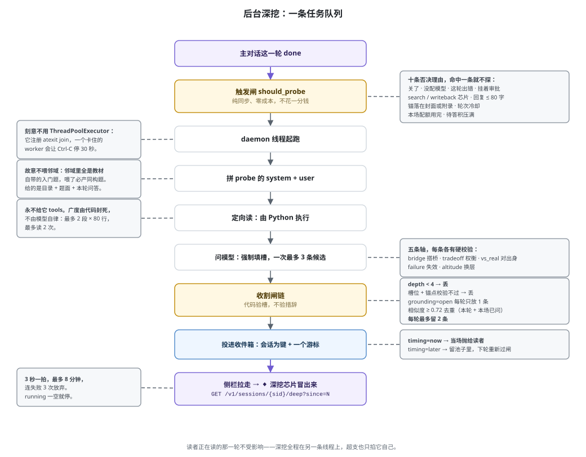

**Why it needed its own layer.** Originally the follow-ups were a by-product — the model appended two
`<!--pen:chips -->` lines at the end of each answer. The trouble is those two were forever tangled in
the detail just discussed ("does echo need quotes here"), while what the reader actually wanted to ask
was architectural. **A hitchhiking follow-up has its field of view locked to that one turn's context.**

So the deep-dive was split out into its own layer, with its own prompt, its own budget and its own ledger.

<details>
<summary><b>Expand: six design constraints, each treating a specific disease</b></summary>

**① A daemon thread the moment `done` fires — deliberately not `ThreadPoolExecutor`.**
`ThreadPoolExecutor` registers an `atexit` hook that joins every worker. One worker stuck on network
IO turns your Ctrl-C into a 30-second wait. A daemon thread doesn't.

**② It never gets tools.**
Targeted reads are executed **by Python**, not decided by the model: a hard ceiling of
**2 passages × 80 lines, at most 2 times**.

> **Breadth is capped by code, not by the model's self-restraint.**

A background job that can decide "let me read a few more sections" is an open-ended invoice.

**③ It is deliberately not fed the neighbourhood.**
The passage around the reader's selection is withheld. The reason is in `pen/probe.py`'s module header:

> Those 4,000 characters are all the handbook's own beginner questions ("what do the quotes in
> `<<'EOF'` do in a heredoc"), and a model staring at them will inevitably produce isomorphic
> questions — that is the root cause of the "does echo need quotes" problem.

It's fed what Socrates just said instead, with code blocks stripped.

**④ A session-keyed inbox plus one cursor.**
`GET /v1/sessions/{sid}/deep?since=N`. The frontend polls every 3 s
(`src/deeppoll.ts`, `DEEP_POLL_MS = 3000`) for at most **480 s** (`DEEP_POLL_BUDGET_MS`),
giving up after 3 consecutive failures (`DEEP_POLL_MAX_FAILS`). Normally it stops as soon as
`running` empties and never approaches that budget.

**⑤ A maturity gate.**
Each question carries a `timing`: `now` is eligible this turn; `later` stays in the pool and
**is re-gated on every subsequent turn** — it surfaces once you've read far enough. Past the gate
there is still the throttle: one per turn, at most.

**⑥ Quality comes from mandatory slots plus deterministic validation, not from flattering the model.**
Every question must fill `axis`, `depth`, `grounding`, `anchors` and `why`. The axes are a closed set:

| Axis | What it must produce |
| --- | --- |
| `bridge` | Hook two places together |
| `tradeoff` | A was chosen and B rejected — at what cost (must fill `alt`) |
| `vs_real` | How it's done in the real world (anchor must land on "third beat · origins", whitelist-checked) |
| `failure` | Under what condition it blows up (must fill `trigger`) |
| `altitude` | Move up one level of abstraction |

Then **Python validates the slots, not the phrasing**: `depth` is self-scored 1–5, and anything
below 4 is discarded (`pen/probe.py:1001`). In [3.4](#34--background-deep-dive-) the English run's
2 calls and 2,002 output tokens were wiped out by exactly this gate.

</details>

### 4.6 · Config is passed per request, never stored in a global slot

One sidecar may serve two vaults at once. Write settings into a global slot and vault A's model
leaks into vault B. So **every knob rides along with each request**.

There are **18** knobs (`LIMIT_RANGE` in `pen/config.py`). Frontend and backend each keep a range
table, and `scripts/check-limits.mjs` is a CI gate whose entire job is to stop those two tables from
drifting — clamping to 30 on one side and 60 on the other is a bug that only ever shows up at the boundary.

### 4.7 · Cost gates: capped by category, never in total

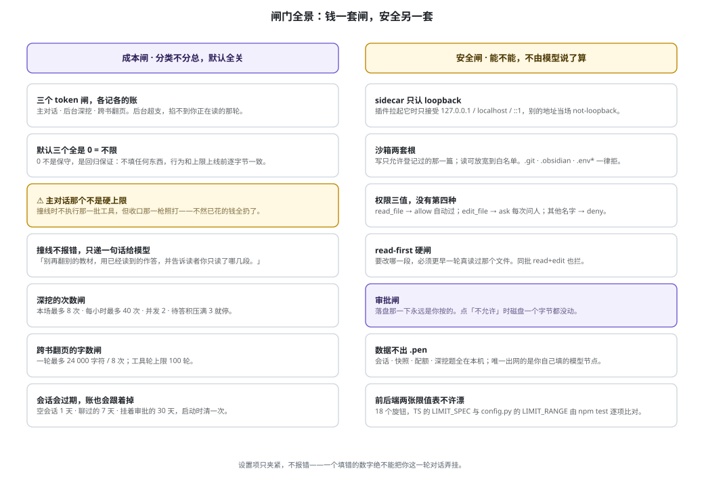

Three token ceilings, **accounted for and capped separately**: main conversation, background
deep-dive, cross-book reading. The reason is practical — a background overrun must not cut off the
turn you're reading. All three default to 0 and 0 means unlimited, the whole test being one line,
`cap > 0 and (spent + max(0, headroom)) >= cap` (`pen/meter.py:167`); that `cap > 0` half *is* the
entire implementation of "0 means unlimited."

Going over is not an error. It appends a sentence telling the model to wrap up rather than raising,
so what you see is a shorter answer, not a red exclamation mark. **The main-conversation cap is not
a hard ceiling**: once the limit is reached you will still get one more answer, because that turn
had already started. The settings page says so, and so does this.

### 4.8 · Sessions expire, and their bills go with them

| Kind | Test | Kept |
| --- | --- | --- |
| Empty session | `len(messages) <= 1` | **1 day** |
| Talked to | everything else | **7 days** |
| Approval pending | `pending.id` set **and not an empty session** | **30 days** |

Why this is needed: before the cleanup shipped, the session directory had grown to
**3,389 files / 10.4 MB**, of which **3,371 were empty** — every highlight creates a session, and
most never saw a first message before the next highlight replaced them.

That "and not an empty session" in the third row was a later tightening. The first version said
"anything with a pending is never deleted," which is an **unbounded exemption**: any file carrying a
`pending` key occupies disk forever and no amount of cleanup can touch it —
**which is precisely the disease being treated.**

<sup>`pen/retention.py`; the module header carries the full measurement log</sup>

### 4.9 · Handbook-agnostic

It works against any Markdown handbook, and the title is injected from **the first-line H1 of your
note**. That sentence is the first line of `SYSTEM_PROMPT`, which is the entire content of
`messages[0]` in every session, frozen and persisted the moment the session is created — hard-code
a title there and the model is told, in its very first sentence, that it is reading a book it isn't
reading. The `messages[0]` actually persisted in that run begins:

> 你是苏格拉底，坐在读者旁边，正在带人读一本叫《从零手写 DQN · 强化学习通关手册（全册：开篇 + Level 0~3 + Capstone）》的通关手册。
>
> *(You are Socrates, sitting beside the reader, walking them through a handbook called
> "Building DQN from Scratch · A Reinforcement Learning Handbook (full: intro + Levels 0–3 + Capstone)".)*

The word **`SWE` appears 0 times** in the whole prompt.

<sup>Raw: [`02b-system-prompt.json`](docs/demo/transcripts/02b-system-prompt.json)</sup>

The title has to be injected twice, because there are two prompt paths. The background deep-dive
runs on a separate one, and its user packet gives the model the position, the reader's words, what
Socrates just said, the footprint, the shelf and the questions already asked — everything except
which book this is. It could only infer the subject from level numbers, beat names and the excerpt,
so it followed the names in the five worked examples in its own prompt, and those five come from a
different book. That path now carries the title too, through the same cleaner `messages[0]` uses:

```
[你在带读哪本书]
《从零手写 DQN · 强化学习通关手册（全册：开篇 + Level 0~3 + Capstone）》
（下面所有材料都出自这本书。它讲什么，看材料——别从别的书上推。）
```

*("Which book you're walking them through" · "Everything below comes from this book. What it's
about — read the material; don't infer it from some other book.")*

<sup>`pen/probe.py:build_user_message`</sup>

**But the eight-beat structure stayed, on purpose.** "Third beat · origins," "fifth beat · Meta
Question gate" and the rest aren't that book's *content*, they're a **format contract**: the
`vs_real` axis requires its anchor to land on the origins beat, and `examples` requires example
names to match the seventh beat. The handbook format and the deep-dive algorithm are interlocked —
write your book in this format and the deep-dive has somewhere to drop anchors, and
[`docs/demo/从零手写DQN.md`](docs/demo/从零手写DQN.md) is a template you can copy.

### 4.10 · One turn, from highlight to written word

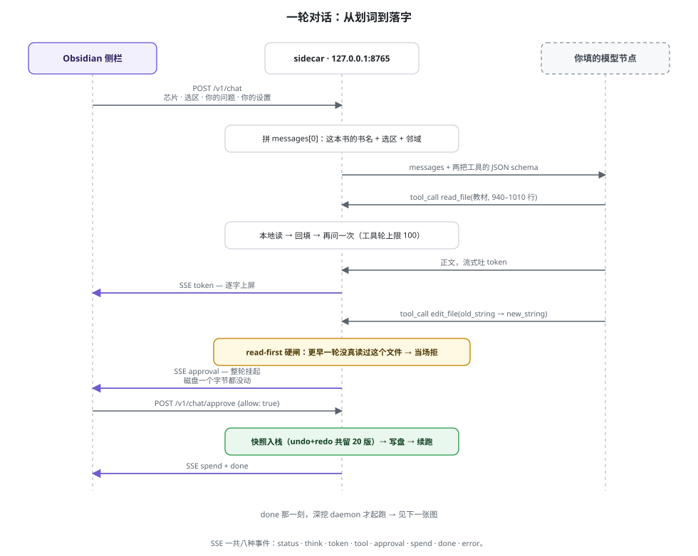

<details>
<summary><b>Expand: the developer layer</b></summary>

**Size** (as of v0.15.11, all measured)

| Part | Size |
| --- | --- |
| Python (sidecar, excluding tests) | 28 modules, 7,814 lines |
| Python tests | 8,700 lines, **487 passed** |
| TypeScript (plugin) | 15 files, 3,839 lines |
| HTTP routes | 23 |
| Config knobs | 18 |

**The SSE event kind lives in the JSON payload's `type` field, not on the SSE `event:` line.**
That's the first thing you'll trip over integrating this API. Eight kinds:

| `type` | What it is |
| --- | --- |
| `status` | Phase: `writing` / `thinking` / `reading` / `tool` |
| `think` | Reasoning trace, when the model exposes one |
| `token` | Answer text, streamed in chunks |
| `tool` | A tool finished; carries `name` / `ok` / `detail` |
| `approval` | **Needs your Allow**; carries `pending_id` / `name` / `args` |
| `spend` | Tokens spent on this turn |
| `done` | Turn over; carries the merged bill |
| `error` | Something broke; carries a localised human-readable message |

**Test gates**

`npm test` is five independent gates, each guarding one thing:

| Gate | Guards |
| --- | --- |
| `check-i18n.mjs` | Vocabulary self-check — the language-parsing edge cases that only bite in reality |
| `check-poll.mjs` | The deep-poll **termination conditions**, run against compiled code. Lose one and it keeps hammering the sidecar after you close the panel |
| `check-api.mjs` | The shape of HTTP errors, run against the compiled `src/api.ts` |
| `check-css.mjs` | Invariants of `styles.css` — every one a pothole we actually hit (run it and it prints the current count) |
| `check-limits.mjs` | **The two clamp tables, frontend and backend, must match item for item** — two halves of one gate |

`npm run build` = `tsc --noEmit && npm test && esbuild`. All three must pass before `main.js` exists.

Backend: `python -m pytest pen/tests -q` → **487 passed**, on any clean checkout
(which was not true before v0.15.1 — see
[`docs/v0.15.1-公开仓测试开箱45红.md`](docs/v0.15.1-公开仓测试开箱45红.md)).

**Handbook index self-check**

```bash
python -m pen.index --check your-note.md
```

It calls no model. The same input always yields the same index —
**that property is the foundation of every locate, anchor and back-reference.**

```
$ python -m pen.index --check docs/demo/从零手写DQN.md
从零手写 DQN · 强化学习通关手册（全册：开篇 + Level 0~3 + Capstone）
path=/Users/you/socrates-pen/docs/demo/从零手写DQN.md
lines=1405 sections=87 qs=21 toc=45
CHECK OK
```

**All five architecture diagrams are `.drawio.svg`** — GitHub renders them as images, and
[draw.io](https://app.diagrams.net/) opens them for editing (the mxGraph model is stored in the root
`<svg>` element's `content` attribute).

</details>

---

## 5 · Install · Use · Privacy

### Install

Three things to check before you start:

- **Obsidian desktop 1.5.0 or later** (not mobile — it starts a Python process on your machine)
- **Python 3.11 or later** on this computer ([python.org](https://www.python.org/downloads/))
- An **API key** for an OpenAI-compatible Chat Completions endpoint

One more thing worth knowing up front: the plugin UI is fully localised, but the model tends to
answer in the language of the book you feed it, so an English handbook is what you want for an
English session — the bundled demo handbook is Chinese. Two rough edges remain here, both listed
under [Future Works](#7--future-works).

Once it's in the community plugin directory, go **Settings → Community plugins → Browse →
Socrates**. Until then install it by hand: download `main.js`, `manifest.json` and `styles.css`
from the [latest GitHub Release](https://github.com/xesws/socrates-pen/releases), put them in
`<Vault>/.obsidian/plugins/socrates-pen/`, and enable it under **Settings → Community plugins**
with Restricted mode off.

The first launch takes about a minute: the plugin creates an isolated environment at
`~/.socrates-pen/venv` and pip-installs the sidecar from this repository, which reaches GitHub and
PyPI. Afterwards the top line of **Settings → Socrates** shows whether the local service is
running. No terminal required at any point.

### Use

1. Wait until the settings page says the local service is **running**, or click **Start**; then
   fill in your API key under **Settings → Socrates**, optionally changing base URL, model and
   thinking level.
2. Open a note and **highlight a passage** (live preview or reading view), then open the Socrates
   sidebar to use the current selection, or run the command-palette item.
3. To write an answer into the note, say **where to insert or replace**, or use the write-back chip
   after a real answer. The model must read the file first, then propose an edit in a separate
   turn; the sidebar asks you to **Allow** before anything is saved.
4. **Roll back / Redo** restore **the whole note** from the snapshot stack, not just the selection.

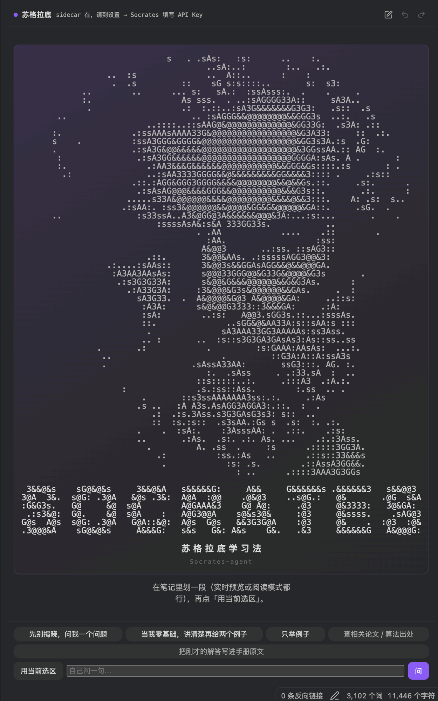

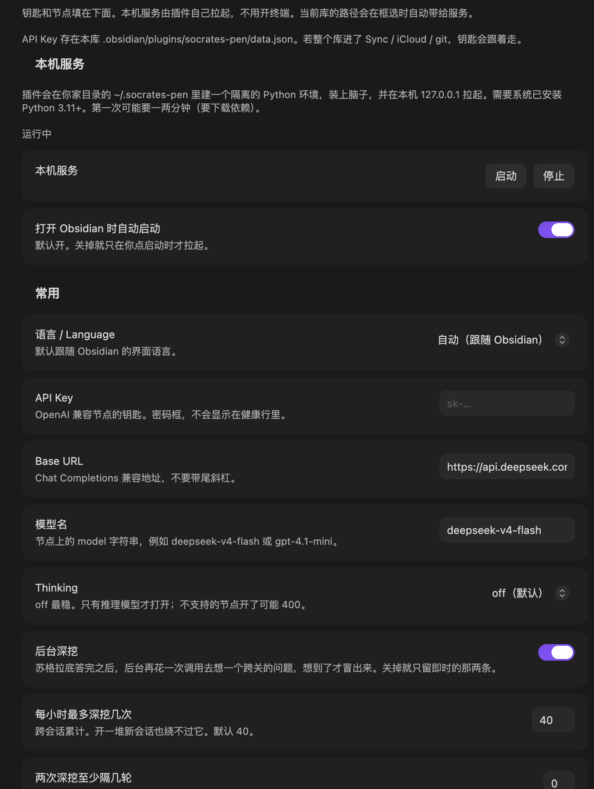

### Privacy and network

**What it does not do.** No indexing, no walking, no uploading: it does not scan your vault and
does not send your notes anywhere. In practice only two things ever get read — the note you
highlighted and the handbooks on your shelf. The plugin talks to `http://127.0.0.1:8765` by default
and does not phone home; sessions, snapshots and the deep-dive ledger all live under
`~/.socrates-pen/` on your own machine.

**But that is behaviour, not a sandbox guarantee.** Only those two get read because those are the
only ones the prompt tells it about. The sandbox's actual *read* boundary is the **whole vault
root** (minus `.git` / `.obsidian` / `.env*`), and that root is registered automatically when the
plugin imports a handbook (`src/views/PenView.ts:788` sends `vaultRoot(app)` to
`POST /handbooks/import`), so you never widen anything by hand. Name a path in the conversation and
it can read it. The *write* boundary is far tighter; see
[4.4 The sandbox has two sets of roots](#44--the-sandbox-has-two-sets-of-roots-reading-and-writing-are-not-the-same-thing).

**The write side is where the real gate is.** Every edit needs your approval first and without it
nothing reaches disk, so asking without writing is a perfectly normal way to use it. What holds
this is the approval gate, not "you didn't click that chip" — saying "add a line after that
paragraph" in `free` sends the model to `edit_file` just the same (`pen/session.py:64`), and the
sidebar asks all the same; the deny demo in
[3.5](#35--writing-back-and-the-approval-gate) runs on the `free` chip
([`08b-approve-deny.json`](docs/demo/transcripts/08b-approve-deny.json)). The real gate is
`pen/agent/permissions.py:18-19`: `edit_file` is always `ask`, for every chip.

**Three things left for you to watch.** One, your API key is stored in this vault at
`.obsidian/plugins/socrates-pen/data.json`, so if the vault is in Sync, iCloud or git, the key goes
with it. Two, the network is touched in exactly two places: installing pulls the sidecar and its
dependencies from GitHub and PyPI into `~/.socrates-pen`, and the first restart after a plugin
upgrade fetches them once more; everything else is the model call itself, leaving from that local
process to the endpoint you configured. Three, disabling the plugin does not stop the sidecar —
that Python process keeps running, so re-enabling is instant. But the "stop" button on the settings
page only governs the process this enable session started itself; if the process was left over from
a previous one, the button will not touch it and you have to kill whatever holds the port.

### It won't install / won't start

The first launch builds a venv and pip-installs — that's where things break. In order:

1. **Read the top line of the settings page.** If it says not running, click **Start**; the error
   shows up right there.
2. **Check your Python.** `python3 --version` in a terminal — 3.11 or later. The one macOS ships
   may be 3.9; get a current one from [python.org](https://www.python.org/downloads/).
3. **If the venv is broken, delete just the venv**: `rm -rf ~/.socrates-pen/venv`, then hit Start
   and it rebuilds. `~/.socrates-pen/` also holds your sessions and snapshots — **don't delete the
   whole directory**.
4. **Port in use.** Default is `127.0.0.1:8765`; `lsof -nP -iTCP:8765 -sTCP:LISTEN` shows who has it.
5. **Still stuck.** Open Obsidian's developer console (`Ctrl/Cmd + Shift + I`) and file the error at
   [Issues](https://github.com/xesws/socrates-pen/issues).

---

## 6 · Development · Tests · License

```bash
npm install
npm test        # five gates: i18n / poll / api / css / limits
npm run build   # tsc --noEmit && npm test && esbuild
```

Live-reload against a real vault:

```bash
export VAULT_PLUGIN_DIR=/path/to/vault/.obsidian/plugins/socrates-pen
npm run dev
```

Without `VAULT_PLUGIN_DIR`, `npm run dev` **exits immediately** — so you can't install a stale copy
into a vault by accident.

Backend:

```bash
python -m pytest pen/tests -q       # 487 passed
python -m pen.index --check your-note.md
```

To reproduce every example in [section 3](#3--features-one-real-example-each) yourself: the handbook is
[`docs/demo/从零手写DQN.md`](docs/demo/从零手写DQN.md), and every step's raw request body and SSE
event stream is in [`docs/demo/transcripts/`](docs/demo/transcripts/).

**License: MIT**, see [LICENSE](LICENSE).

---

## 7 · Future Works

What it cannot do yet, or does poorly:

**It cannot search the web.** The sidebar chip for papers / provenance is greyed out. Socrates only
reads notes in your vault.

**Deep follow-up questions work best on a structured handbook.** Background probes look for sections
named like 「第三拍 · 出身」 and 「第七拍 · 实操」. Ordinary notes, or English books without those
headings, still work for the main conversation; cross-chapter probes get weaker. See
[`docs/demo/从零手写DQN.md`](docs/demo/从零手写DQN.md) for a template.

**Keep the UI language and the book language the same.** An English UI over a Chinese handbook often
still answers in Chinese. Switch the book to English, or the UI to Chinese.

**Very few model combinations have been tested.** The examples in this README all ran on
`deepseek/deepseek-v4-flash`. Other OpenAI-compatible endpoints should work by protocol; they have
not been tried one by one.

---

<div align="center">
<sub>

MIT · [xesws/socrates-pen](https://github.com/xesws/socrates-pen)

[中文](README.md) · **English**

</sub>
</div>
