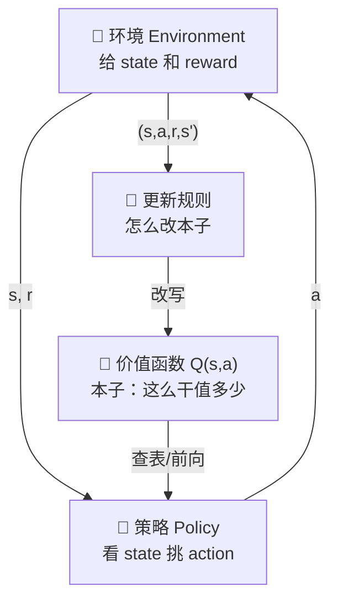

# 从零手写 DQN · 强化学习通关手册（全册：开篇 + Level 0~3 + Capstone）

> 这是一本**演示用**的教材，随苏格拉底插件一起发。
> 它存在的唯一理由是：证明这支笔不只服务写它的那本书——把任何一本按这个体例写的手册丢进来，划词、追问、深挖、写回都照常工作。
> 内容是真的（每条出处都能查到论文），但篇幅是删过的：一本真手册该有一万行，这本只有九百行。

# 开篇：你即将训练一个只会试错的实习生

## 这本手册为什么存在

你大概已经会写神经网络了：给一堆 `(x, y)`，让模型把 `f(x)` 拟合到 `y` 上。监督学习舒服在哪？**答案是白给的。** 每个样本都自带一个标准答案，损失函数照着抄就行。

强化学习难，难在**没人给标准答案**。你只有一个环境、一个能按按钮的实习生，和一个偶尔响一下的铃。实习生按了一百下按钮，铃响了三次——哪一下按对了？可能是第 7 下，也可能是第 7 下和第 92 下合起来才对。这叫**信用分配问题**（credit assignment），是整个强化学习绕不开的那道坎。

这本手册要带你手搓的东西叫 DQN（Deep Q-Network）。它 2015 年发在 Nature 上，用同一套代码、同一组超参数，在 49 个 Atari 游戏上打到人类水平。它之所以能跑起来，靠的不是网络更深，而是**两个看起来像作弊的工程决策**：一个 Q 网络冻住不动，另一个在更新；经验不当场用，先扔进一个大池子里搅匀再捞。

这两条正是本书的重头戏。它们不是调参调出来的，是被**逼**出来的——不这么干，训练会发散，而且是那种一去不回头的发散。

## 全书统一比喻：赌场里的实习生

全书只用一个比喻，从头用到尾：

- **实习生（agent）**：记性为零、胆子极大。他不理解任何东西，只会「按按钮 → 看铃响不响 → 下次更倾向于按响过铃的那个」。
- **赌场（environment）**：一排老虎机，后来变成一间会变布局的赌场。它只回两样东西：**你落到哪个房间了**（状态），和**这一下给你几个筹码**（奖励）。
- **筹码（reward）**：一个数。不是分数，不是评价，就是一个数。
- **实习生的小本子（value function）**：他在本子上记「站在这个房间、按这个按钮，长远看大概能拿多少筹码」。**整本书都在教这个本子怎么记、怎么改、以及为什么它会记着记着就崩了。**

比喻里最要紧的一条：**实习生永远不知道赌场的规则。** 他不知道哪个房间通向哪个房间，也不知道哪台机器吐钱概率高。他只有一条路——试。

## 全景图：四块积木怎么拼成一个 DQN



四块积木，本书一关拆一块：

| 关 | 拆哪块 | 一句话 |
| --- | --- | --- |
| Level 0 | 环境 | 把「赌场」写成数学：MDP 和贝尔曼方程 |
| Level 1 | 本子 + 更新规则 | 本子是一张表，用 Q-learning 改它 |
| Level 2 | 本子换成神经网络 | 表装不下了，换网络——然后训练开始发散 |
| Level 3 | 修发散 | target network + replay buffer，DQN 成型 |

## 本书玩法说明（务必读完再开工）

每一关八拍，顺序固定：

1. **第一拍 · 📍你在哪一格** — 全景图上的位置，上一格给了你什么，你要交给下一格什么
2. **第二拍 · 铺垫** — 为什么这一关非学不可
3. **第三拍 · 出身** — 这个 idea 最早出自哪篇论文、谁提的、当时在解决什么问题
4. **第四拍 · 设计** — 本关的几个设计决策，每个都问「为什么不选另一条路」
5. **第五拍 · 📝 Meta Question 门禁** — 自测题。答对 ≥80% 才能进第六拍
6. **第六拍 · 伪代码** — 不带实现细节的骨架
7. **第七拍 · 实操代码** — 能跑的 Python
8. **第八拍 · ⚠️坑 / ✅验收 / 承上启下**

**第三拍是本书的特色**：每个 idea 都写清楚出身。你会在第三拍里看到 Bellman 1957、Watkins 1989、Tsitsiklis & Van Roy 1997、Mnih 2015、van Hasselt 2016 这些名字——它们不是装饰，是让你知道「这条经验是谁付了代价换来的」。

# Level 0 — 多臂老虎机与 MDP（实习生第一天：世界长什么样）

## 第一拍 · 📍你在哪一格

> **📍 你在哪一格**
>
> - **全景图位置**：最上面那格「🎰 环境」。这一关你不训练任何东西，你只是把「赌场」这件事写成数学。
> - **上一格交给你什么**：什么都没有——这是第一天。你只知道有个实习生和一排机器。
> - **你交给下一格什么**：一套记号（状态、动作、奖励、折扣、策略、价值），和一条**贝尔曼方程**。Level 1 会把这条方程直接改写成一行可执行的更新规则。

## 第二拍 · 铺垫：为什么第一关是老虎机

先想清楚一个问题：**监督学习的标签从哪来？** 从人来。有人标了「这张图是猫」，模型才有得学。

强化学习没有这个人。实习生按下按钮，环境只回一个数。那这个数够不够当标签？

不够。因为**这一下的好坏，取决于后面还会发生什么**。你在国际象棋里弃掉一个后，当场的「奖励」是负的，但十步之后你赢了。如果你拿当场那个负数当标签，你会学出一个永远不敢弃子的实习生。

所以强化学习的第一件事，不是学习，是**先把「长远看值多少」这件事定义清楚**。这就是价值函数，也是本关的全部内容。

而老虎机是这件事的**最小可能版本**：只有一个状态（你永远站在同一排机器前面），只有 k 个动作（拉哪一台）。把状态去掉之后，「长远」也没了，只剩「这台机器的平均吐钱率是多少」。先在这个最简单的壳里想明白**探索和利用的矛盾**，再把状态加回来，MDP 就自然长出来了。

## 第三拍 · 出身：MDP 和贝尔曼方程从哪来

**多臂老虎机（multi-armed bandit）** 这个名字和这个问题，最早由 Herbert Robbins 在 1952 年的论文 *Some aspects of the sequential design of experiments* 里系统化。更早的源头是二战期间的临床试验分配问题：有两种药，你得一边治病人一边判断哪种更好——**每一次「试」都是有代价的**，这就是探索和利用矛盾的原始场景。

**马尔可夫决策过程（MDP）** 和**贝尔曼方程**出自 Richard Bellman 1957 年的书 *Dynamic Programming*。「动态规划」这个词也是他起的——他后来在自传里说，之所以叫这么个含糊的名字，是因为当时他的资助方（美国空军）的部长讨厌「研究」和「数学」这两个词，起个听起来像工程的名字才好报预算。

**「维数灾难」（curse of dimensionality）** 同样是 Bellman 造的词，就在同一本书里。这是本手册 Level 2 那一关的病根：状态一多，表就装不下了。

**策略迭代（policy iteration）** 出自 Ronald Howard 1960 年的 *Dynamic Programming and Markov Processes*。

**这一关的教材出处**：Sutton & Barto, *Reinforcement Learning: An Introduction*（第二版 2018），第 2 章讲老虎机，第 3 章讲 MDP，第 4 章讲动态规划。全书作者免费公开，是这个领域事实上的标准教材。

## 第四拍 · 设计：本关的四个设计决策

**决策① 为什么状态必须满足马尔可夫性**

马尔可夫性说的是：**下一步会怎样，只取决于你现在在哪、你要干什么，和你怎么走到这儿的无关。**

写成式子就是 $P(s_{t+1} \mid s_t, a_t) = P(s_{t+1} \mid s_t, a_t, s_{t-1}, a_{t-1}, \dots)$。

为什么非要这条？因为**没有它，价值函数就没法定义**。价值函数 $V(s)$ 是「站在 s 这个状态上值多少」——如果值多少还取决于你是怎么来的，那 $V$ 就不是 $s$ 的函数，是整条历史的函数，而历史是无限长的，你记不下来。

这条不是「真实世界恰好满足」，而是**你负责把状态设计成满足它**。Atari 那篇论文里，单帧画面不满足马尔可夫性（你看不出球在往哪飞），所以他们把**连续 4 帧叠起来**当一个状态——速度信息就进来了。这是工程决策，不是自然规律。

**决策② 为什么折扣因子 γ 必须小于 1**

累计奖励定义成 $G_t = r_{t+1} + \gamma r_{t+2} + \gamma^2 r_{t+3} + \cdots$。

γ < 1 有两个理由，一个是经济学的，一个是数学的，**后者才是硬的**：

- **经济学的**：今天的一块钱比明年的一块钱值钱。这个说法好听，但不是必须。
- **数学的**：任务如果**永不结束**（continuing task），γ = 1 时这个和就是无穷多项加起来，只要奖励不恒为零就发散。$V(s) = \infty$ 对每个状态都成立，那你就没法比较哪个状态更好。γ < 1 时，只要奖励有界 $|r| \le R_{\max}$，级数被 $R_{\max}/(1-\gamma)$ 压住，**必收敛**。

还有第三条，Level 1 才用得上：γ 同时是**贝尔曼算子的压缩系数**。正因为 γ < 1，那个算子才是压缩映射，才有唯一不动点，Q-learning 才有得收敛。这条是本书 Q4 和 Level 1 的连接点。

**决策③ 为什么记「价值」而不是直接记「该按哪个按钮」**

直接记策略行不行？行，那叫策略梯度方法，是另一条技术路线（REINFORCE、PPO 都在那条线上）。

但价值这条路有一个便宜可占：**价值函数自带一个递归结构**，也就是贝尔曼方程

$$Q(s,a) = \mathbb{E}\left[r + \gamma \max_{a'} Q(s', a')\right]$$

这条式子说的是：「这么干值多少」= 「当场拿到多少」+ γ ×「落到下个房间之后，最好那个选择值多少」。

**它把一个关于无穷远未来的量，改写成了只跟下一步有关的量。** 这就是自举（bootstrapping）——用你自己现在的估计，去更新你自己现在的估计。

自举是本书后面所有麻烦的源头。Level 2 会告诉你，它和另外两样东西凑在一起时会出人命。

**决策④ 探索和利用：为什么不能只挑当前最好的**

实习生记了本子之后，最自然的做法是「每次挑本子上分数最高的」。这叫贪心（greedy），而它会死。

为什么会死：他第一次随手拉了 3 号机，吐了 1 个筹码；1 号机他从没拉过，本子上是 0。于是他永远拉 3 号——**1 号机哪怕平均吐 100 个，他也永远不会知道**。

最简单的解法叫 **ε-贪心**：以 1−ε 的概率挑本子上最好的，以 ε 的概率**完全随机**拉一台。ε 通常从 1.0 线性退火到 0.05——一开始全靠瞎试，后面越来越信本子。

要注意这里有个容易糊弄过去的点：ε-贪心**并不是**最优的探索策略（UCB 和 Thompson sampling 都有更好的理论界）。选它的唯一理由是**便宜且够用**——一行代码，没有额外超参，在 Atari 上够了。这是工程取舍，不是理论胜利。

## 第五拍 · 📝 Meta Question 门禁

> **门禁规则：先答题再动手。自测答对 ≥80%（5 题对 4 题）才能进第六拍实操；答错的题按题末标注回读对应小节。**

**Q1. 折扣因子 γ 为什么必须小于 1？只说「未来的钱不值钱」够不够？**
- **TL;DR：** 不够。经济学理由是软的，硬理由是**收敛性**：持续型任务下 γ = 1 会让累计奖励发散成无穷大，价值函数失去可比性。
- **(a) 概念/对比：** $G_t = \sum_{k=0}^{\infty} \gamma^k r_{t+k+1}$。γ = 1 时这是一个无穷级数的裸和；γ < 1 时它是一个几何级数，被 $R_{\max}/(1-\gamma)$ 界住。
- **(b) 机制：** 有限步就结束的**分幕型任务**（episodic，比如一局棋）可以取 γ = 1，因为项数有限。**持续型任务**（continuing，比如恒温器控制）不行。所以严格说 γ < 1 是持续型任务的必要条件，不是所有任务的。
- **(c) 反例：** 一个每步给 +1、永不终止的环境，γ = 1 时每个状态的价值都是 +∞。实习生比较两个房间，发现 ∞ = ∞，本子彻底失效。
- **(d) 还有一层：** γ 也是贝尔曼算子的**压缩系数**（见 Q4）。γ 越接近 1，压缩越弱，收敛越慢，方差越大——这是实践中 γ 常取 0.99 而不是 0.9999 的原因。

〔回读：第四拍 · 设计 · 决策②〕

**Q2. 马尔可夫性到底在保护什么？违反了会怎样？**
- **TL;DR：** 它保护的是「价值函数是**状态**的函数」这件事本身。违反了，$V(s)$ 就不是良定义的。
- **(a) 概念/对比：** 马尔可夫性 = 未来只依赖当前状态和动作，不依赖历史。
- **(b) 机制：** 价值函数写成 $V(s)$，前提是「站在 s 上」这件事**穷尽了所有对未来有影响的信息**。不然同一个 s，来路不同、未来不同、价值不同，一个符号装不下两个数。
- **(c) 反例：** Atari 的单帧画面。看一张 Breakout 的截图，你不知道球是在上升还是下落——这两种情况该按的键完全相反，但状态一模一样。Mnih 2015 的做法是**把连续 4 帧叠成一个状态**，把速度信息塞进去。这不是理论，是把环境改造成满足假设。
- **(d) 更硬的情况：** 真的没法用有限帧补全时（部分可观测），问题就变成 POMDP，得上循环网络或者信念状态——那是另一本书的事。

〔回读：第四拍 · 设计 · 决策①〕

**Q3. 贝尔曼方程凭什么能把「无穷远的未来」变成「只看下一步」？**
- **TL;DR：** 靠递归。把累计奖励的定义拆开第一项，剩下的部分**恰好就是下一状态的累计奖励**，于是同一个符号出现在等号两边。
- **(a) 推导：** $G_t = r_{t+1} + \gamma(r_{t+2} + \gamma r_{t+3} + \cdots) = r_{t+1} + \gamma G_{t+1}$。两边取期望就是贝尔曼方程。
- **(b) 机制：** 这一步没有任何近似，是恒等变形。神奇的地方在于：**它把「求一个无穷和」换成了「解一个方程」**——而方程可以迭代求解。
- **(c) 为什么重要：** 这就是自举。代价是你在用一个**还没学准的估计**去更新自己。Level 2 会告诉你这个代价有多大。
- **(d) 反例：** 蒙特卡洛方法就**不**自举——它跑完一整幕，拿真实的 $G_t$ 当目标。无偏，但必须等到幕结束，而且方差巨大。自举是拿偏差换方差和及时性。

〔回读：第四拍 · 设计 · 决策③〕

**Q4. 为什么贝尔曼最优算子是压缩映射？这件事有什么用？**
- **TL;DR：** 因为 γ < 1。压缩映射有唯一不动点，且从任意初值迭代必然收敛到它——这是「Q-learning 会收敛」这句话的全部理论基础。
- **(a) 定义：** 贝尔曼最优算子 $(\mathcal{T}Q)(s,a) = \mathbb{E}[r + \gamma \max_{a'} Q(s',a')]$。
- **(b) 证明骨架：** 对任意两个 Q 函数，$\|\mathcal{T}Q_1 - \mathcal{T}Q_2\|_\infty \le \gamma \|Q_1 - Q_2\|_\infty$。关键一步是 $|\max_a f(a) - \max_a g(a)| \le \max_a |f(a) - g(a)|$——max 操作不放大无穷范数距离。γ 从折扣项原样落下来，成了压缩系数。
- **(c) 用处：** 由 Banach 不动点定理，$\mathcal{T}$ 有唯一不动点 $Q^*$，且反复作用于任意初值都收敛到它。**「表格 Q-learning 会收敛」这句话，收敛到的就是这个不动点。**
- **(d) 反例：** γ = 1 时压缩系数是 1，不再是**严格**压缩，唯一性和收敛性一起没了。这是 Q1 那条硬理由的另一副面孔。

〔回读：第四拍 · 设计 · 决策②〕

**Q5. ε-贪心是最好的探索策略吗？**
- **TL;DR：** 不是。它是**最便宜且够用**的那个。
- **(a) 对比：** UCB（置信上界）按「这个动作我试得少，所以它的不确定性大」来加分，在老虎机上有 $O(\log T)$ 的遗憾界；Thompson sampling 按后验采样，实践中常常更好。ε-贪心的遗憾是线性的（ε 固定时）。
- **(b) 机制：** ε-贪心的随机探索是**均匀的**——它不区分「我从没试过的动作」和「我试了一百次确认很烂的动作」，两者被选中的概率一样。这是它理论上落后的根本原因。
- **(c) 为什么 DQN 还用它：** 状态空间一大，UCB 需要的计数就没法维护了（每个 (s,a) 数一遍？状态是连续的）。ε-贪心不需要任何额外状态，一行代码。**在能用的方法里，它是最省事的那个。**
- **(d) 实践细节：** ε 从 1.0 线性退火到 0.1（Mnih 2015 用的是前 100 万帧退到 0.1），评估时再降到 0.05。退火本身就是把「先探索后利用」写死进了时间表。

〔回读：第四拍 · 设计 · 决策④〕

## 第六拍 · 伪代码

```text
# 老虎机：只有动作，没有状态
初始化 Q[a] = 0，计数 N[a] = 0，对所有 a
循环 T 次：
    以概率 ε      → a ← 随机挑一台
    以概率 1-ε    → a ← argmax_a Q[a]
    拉动 a，拿到奖励 r
    N[a] += 1
    Q[a] += (r - Q[a]) / N[a]        # 增量式求平均

# MDP：把状态加回来，价值迭代（知道环境模型时能这么算）
初始化 V[s] = 0，对所有 s
重复直到 V 不再变化：
    对每个 s：
        V[s] ← max_a  Σ_{s'} P(s'|s,a) · [ R(s,a,s') + γ·V[s'] ]
```

注意第二段的前提：**它要求你知道 $P(s'|s,a)$**，也就是赌场的规则。实习生不知道。所以这段代码只是让你看清贝尔曼方程长什么样，**不是**本书要手搓的东西。Level 1 会把它改成不需要模型的版本。

## 第七拍 · 实操代码

```python
"""Level 0 · 十臂老虎机：ε-贪心 vs 纯贪心。

依赖：numpy。这一关不需要 PyTorch。
"""

from __future__ import annotations

import numpy as np


class Bandit:
    """十臂老虎机。每台机器的真实吐钱率是固定的，实习生不知道。

    provenance：本类是本文档自定义的，不来自任何库。
    """

    def __init__(self, k: int = 10, seed: int = 0) -> None:
        self.k: int = k                                  # 机器台数
        self.rng: np.random.Generator = np.random.default_rng(seed)
        # 每台机器的真实均值，实习生看不到。q_true:(k,)
        self.q_true: np.ndarray = self.rng.normal(0.0, 1.0, size=k)  # (k,)

    def pull(self, a: int) -> float:
        """拉第 a 台，返回一个带噪声的奖励（标量）。"""
        return float(self.q_true[a] + self.rng.normal(0.0, 1.0))

    def best_action(self) -> int:
        return int(np.argmax(self.q_true))               # q_true:(k,) → 标量索引


def run(eps: float, steps: int = 2000, seed: int = 0) -> tuple[np.ndarray, np.ndarray]:
    """跑一轮 ε-贪心，返回 (每步奖励, 每步是否选中最优臂)。

    返回：rewards:(steps,)，optimal:(steps,)，都是 float64。
    """
    env = Bandit(seed=seed)
    rng = np.random.default_rng(seed + 1000)
    Q = np.zeros(env.k)                                  # Q:(k,) 本子
    N = np.zeros(env.k, dtype=np.int64)                  # N:(k,) 每台拉过几次
    rewards = np.zeros(steps)                            # (steps,)
    optimal = np.zeros(steps)                            # (steps,)
    best = env.best_action()

    for t in range(steps):
        if rng.random() < eps:
            a = int(rng.integers(env.k))                 # 探索：均匀随机
        else:
            a = int(np.argmax(Q))                        # 利用：Q:(k,) → 标量索引
        r = env.pull(a)
        N[a] += 1
        # 增量式求平均：Q_new = Q_old + (r - Q_old)/N，等价于前 N 次奖励的算术平均，
        # 但不需要把历史奖励存下来。这个形式和 Level 1 的 TD 更新长得一模一样——
        # 差别只是那边分母换成了固定的学习率 α。
        Q[a] += (r - Q[a]) / N[a]
        rewards[t] = r
        optimal[t] = 1.0 if a == best else 0.0

    return rewards, optimal


if __name__ == "__main__":
    for eps in (0.0, 0.01, 0.1):
        # 跑 200 组不同种子取平均，单组噪声太大看不出趋势
        opt = np.mean([run(eps, seed=s)[1] for s in range(200)], axis=0)  # (200,steps)→(steps,)
        print(f"eps={eps:<5} 最后 100 步选中最优臂的比例：{opt[-100:].mean():.1%}")
```

跑出来大致是这样（数字随种子浮动）：

```text
eps=0.0   最后 100 步选中最优臂的比例：36.5%
eps=0.01  最后 100 步选中最优臂的比例：76.2%
eps=0.1   最后 100 步选中最优臂的比例：82.9%
```

**纯贪心（ε=0）卡在 36%**，因为它第一次随手拉中哪台就认定哪台，剩下九台永远不碰。这就是决策④那个「会死」的具体样子。

## 第八拍 · ⚠️坑 / ✅验收 / 承上启下

**⚠️ 常见坑**

1. **把 γ 当成超参随便调**：γ 变了，你要解的**问题本身**就变了（不同的 γ 对应不同的最优策略），不是同一个问题的不同解法。
2. **以为分幕型任务也必须 γ < 1**：不必须。项数有限就不会发散。但实践中还是常取 0.99，因为它顺带压住了远期估计的方差。
3. **拿单帧画面当状态**：违反马尔可夫性，学出来的东西看着能动，实际上永远学不会接球（回读 Q2）。
4. **以为 ε-贪心的 ε 越大越好**：ε 大 = 一直在瞎按，学到的本子再准也用不上。要退火。
5. **把增量平均 `Q += (r-Q)/N` 里的 `N` 写成全局步数**：那是所有臂共用一个分母，每台机器的估计都会被拉偏。

**✅ 验收**

跑通第七拍那段代码，看到 ε=0 明显低于 ε=0.1 即过关。再改一处验边界：把 `eps=0.1` 改成 `eps=1.0`（永远随机），最优臂比例应该稳定在 **1/k = 10%** 附近——这验证了你的随机分支确实是均匀的。

**承上启下**

本格交出了什么：一套记号（s, a, r, γ, π, V, Q），一条贝尔曼方程，和一个已经能跑的探索策略。你也看到了 `Q[a] += (r - Q[a]) / N[a]` 这个形状——**记住它，下一关它会原封不动地再出现一次。**

下一格是 **Level 1 — 表格 Q-learning**。为什么需要它：本关的老虎机没有状态，所以「长远」这个词其实是假的。把状态加回来之后，实习生就得在本子上记 `(房间, 按钮) → 分数` 的二维表，而怎么改这张表，正是 Q-learning 要回答的问题。

# Level 1 — 表格 Q-learning（把经验记进一张表）

## 第一拍 · 📍你在哪一格

> **📍 你在哪一格**
>
> - **全景图位置**：中间那两格「📒 价值函数」和「🔧 更新规则」。这一关本子是一张**真的表**，你能把它打印出来看。
> - **上一格交给你什么**：贝尔曼方程，和一个已经会探索的实习生。但上一关的赌场没有状态，「长远」是假的。
> - **你交给下一格什么**：一条能跑的更新规则，和一句**有证明的**「它会收敛」。Level 2 会把这张表换成神经网络，然后你会发现那句证明**一条也不成立了**。

## 第二拍 · 铺垫：为什么不能直接用 Level 0 的价值迭代

Level 0 第六拍那段价值迭代，写着 $\sum_{s'} P(s'|s,a)\,[\dots]$。

这个 $P(s'|s,a)$ 是**赌场的规则**——从这个房间按这个按钮，去到各个房间的概率分别是多少。实习生不知道。他要是知道，他就不用学了，直接算就完了。

所以问题变成：**能不能不知道 P，只靠「试出来的样本」，把那个求和给替掉？**

能。因为那个求和就是一个期望，而**期望可以用样本来估**。你不知道骰子每面的概率，但你摇一万次，平均值就逼近期望。这就是蒙特卡洛的思路，也是本关的第一块砖。

第二块砖更妙：你不需要摇一万次再更新一次。你可以**摇一次就往那个方向挪一小步**。挪的步长叫学习率 α，挪的方向叫 TD 误差。这就是 Level 0 最后那个 `Q += (r - Q)/N` 的形状——只不过分母从 N 换成了固定的 1/α。

## 第三拍 · 出身：Q-learning 从哪来

**Q-learning** 出自 Chris Watkins 1989 年在剑桥的博士论文 *Learning from Delayed Rewards*。这篇论文同时给出了算法和 Q 这个记号（Q 取自 "quality"）。

**收敛性证明**是三年后补上的：Watkins & Dayan, *Q-learning*, Machine Learning 8(3-4), 1992。这篇短文证明了在满足一定条件下，表格 Q-learning 以概率 1 收敛到 $Q^*$。**Level 2 会逐条拆掉这些条件。**

**时序差分（TD）学习**的源头更早：Richard Sutton, *Learning to Predict by the Methods of Temporal Differences*, Machine Learning 3(1), 1988。TD(0) 是 Q-learning 的直接祖先——它学的是 $V$ 不是 $Q$，但「用下一步的估计更新这一步的估计」这个核心动作是一样的。

**收敛条件的数学出身**要追到更远：Herbert Robbins & Sutton Monro, *A Stochastic Approximation Method*, 1951。那篇论文里的**步长条件** $\sum \alpha_t = \infty,\ \sum \alpha_t^2 < \infty$ 至今仍是所有随机逼近算法的收敛前提，Q-learning 的证明直接引用它。

（顺带一提：这个 Robbins 和 Level 0 老虎机那个 Robbins 是同一个人。）

**这一关的教材出处**：Sutton & Barto 第二版第 6 章（TD 学习），6.5 节就叫 Q-learning。

## 第四拍 · 设计：本关的四个设计决策

**决策① 为什么学习率用固定的 α，不用 1/N**

Level 0 用的是 `Q += (r - Q)/N`，也就是 $\alpha_t = 1/N$。这个选择在**平稳**环境下是最优的：它算的是精确的算术平均，而且 $\sum 1/t = \infty$、$\sum 1/t^2 < \infty$，正好满足 Robbins-Monro 条件。

但强化学习里环境常常**不平稳**——不是环境本身在变，而是**你自己的策略在变**。你今天的 Q 值是在旧策略下采出的样本上学的，明天策略变了，那些样本就过时了。$1/N$ 会给早期的（过时的）样本和最新的样本**一样的权重**，越到后面新样本越推不动它。

固定 α 的更新展开是指数加权平均：

$$Q_t = (1-\alpha)^t Q_0 + \sum_{i=1}^{t} \alpha (1-\alpha)^{t-i} r_i$$

老样本的权重按 $(1-\alpha)^{t-i}$ 指数衰减——**永远追得上变化**。

代价是它**不满足** $\sum \alpha_t^2 < \infty$（固定 α 的平方和是发散的），所以严格意义上它不收敛到一个点，而是在最优值附近抖。**这是一笔明明白白的交易：拿渐近收敛性换追踪能力。** 实践中所有人都做这笔交易。

**决策② off-policy：为什么 Q-learning 学的和它做的不是一回事**

看更新规则里那个 $\max_{a'}$：

$$Q(s,a) \leftarrow Q(s,a) + \alpha\left[r + \gamma \max_{a'} Q(s',a') - Q(s,a)\right]$$

实习生**实际上**下一步会怎么走？按 ε-贪心，有 ε 的概率乱按。但更新式里写的是 $\max_{a'}$——**假设他下一步走的是最好的那个**。

学的（目标策略，贪心）和做的（行为策略，ε-贪心）是两个策略，这叫 **off-policy**。

好处非常大：**你可以拿任何来路的数据学最优策略**。别人跑的数据、很久以前跑的数据、人类演示的数据，都能用。**Level 3 的经验回放池能存在，全靠这一条。** 如果算法是 on-policy 的，池子里那些用旧策略采的样本就是毒药，用一条错一条。

对照组是 **SARSA**：把 $\max_{a'} Q(s',a')$ 换成 $Q(s', a')$，其中 $a'$ 是**实际要执行的那个动作**。它学的就是它做的，叫 on-policy。

**决策③ 收敛要什么条件**

Watkins & Dayan 1992 的结论要三样东西：

1. **每个 (s,a) 都被访问无穷多次**——所以探索不能停，ε 不能退火到 0
2. **学习率满足 Robbins-Monro 条件**：$\sum_t \alpha_t = \infty$（步子加起来足够长，能走到任何地方）且 $\sum_t \alpha_t^2 < \infty$（步子衰减得足够快，噪声被压住）
3. **Q 值用表格精确表示**——每个 (s,a) 有自己独立的一格，改一格不影响任何别的格

**第三条是本书的转折点。** 它看起来最不像条件（谁会觉得「用一张表」是个假设？），但它恰恰是 Level 2 一上来就要打破的那一条。

**决策④ max 是从哪来的，它带了什么副作用**

$\max$ 来自贝尔曼**最优**方程——你要学的是最优策略，最优策略在每个状态就是挑 Q 最大的那个动作。

副作用叫**最大化偏差**（maximization bias）：$\mathbb{E}[\max_a \hat{Q}(a)] \ge \max_a \mathbb{E}[\hat{Q}(a)]$。

用人话说：**你在一堆带噪声的估计里挑最大的那个，挑中的往往是运气最好的那个，不是真的最好的那个。** 于是 Q 值系统性地被高估。

噪声越大高估越狠，而自举会把这个高估**一路传下去**：高估的 $Q(s',a')$ 进了 $Q(s,a)$ 的目标，$Q(s,a)$ 也跟着高估。

这条在表格里不致命（访问次数一多噪声就小了），但**在 Level 3 的神经网络里会变成一个真问题**——van Hasselt 2016 的 Double DQN 就是专门治它的。

## 第五拍 · 📝 Meta Question 门禁

> **门禁规则：先答题再动手。自测答对 ≥80%（5 题对 4 题）才能进第六拍实操；答错的题按题末标注回读对应小节。**

**Q6. Q-learning 凭什么不需要知道环境的转移概率？**
- **TL;DR：** 因为贝尔曼方程里那个求和本质是个**期望**，而期望可以用单个样本做无偏估计。
- **(a) 对比：** 价值迭代写 $\sum_{s'} P(s'|s,a)[\cdots]$，要遍历所有可能的下一状态。Q-learning 只用**实际发生的那一个** $s'$。
- **(b) 机制：** 单个样本 $r + \gamma \max_{a'} Q(s',a')$ 是那个期望的无偏估计，噪声很大。用小学习率 α 反复平均，方差就被压下去了——这就是随机逼近（Robbins-Monro 1951）的整个思路。
- **(c) 反例：** 如果 α 取 1（完全信任单个样本），Q 值会跟着每次采样剧烈跳动，永远不收敛。α 小才是在做平均。
- **(d) 代价：** 样本效率。价值迭代一次扫描用上了全部模型信息，Q-learning 得靠反复采样把同样的信息试出来。

〔回读：第二拍 · 铺垫〕

**Q7. 什么叫 off-policy？Q-learning 哪个地方 off 了？**
- **TL;DR：** 更新式里的 $\max_{a'}$。它假设下一步走最优动作，但实习生实际按 ε-贪心走，有 ε 的概率乱按。学的策略 ≠ 做的策略。
- **(a) 对比：** SARSA 用的是 $Q(s',a')$，$a'$ 是真正要执行的那个动作——学的就是做的，on-policy。
- **(b) 机制：** off-policy 让你能从**任何来路的数据**里学最优策略：旧策略的、别人的、人类演示的。
- **(c) 为什么这条决定了 Level 3 能不能成立：** 经验回放池里存的是**过去很多个策略**采出来的数据。on-policy 算法用它们会算错梯度；off-policy 算法照单全收。**没有 off-policy，就没有 replay buffer，也就没有 DQN。**
- **(d) 经典反例（Cliff Walking）：** 悬崖边走路，Q-learning 学出的最优路是**贴着悬崖走**（最短），但因为执行时有 ε 的随机，它会时不时掉下去，**实际得分反而比 SARSA 差**。SARSA 学到的是「考虑到我会手抖，离悬崖远一点」。两个都对——它们回答的是不同的问题。

〔回读：第四拍 · 设计 · 决策②〕

**Q8. 表格 Q-learning 收敛需要哪三个条件？哪一个最容易被悄悄破坏？**
- **TL;DR：** ① 每个 (s,a) 访问无穷多次 ② 学习率满足 $\sum\alpha_t=\infty,\ \sum\alpha_t^2<\infty$ ③ **表格表示**。最容易被悄悄破坏的是第三条——因为它根本不像个条件。
- **(a) 逐条：** 第一条要求探索永不停止；第二条来自 Robbins-Monro 1951；第三条要求每个 (s,a) 有独立的一格。
- **(b) 机制：** 第三条保证更新是**局部的**：改 $Q(s_1,a_1)$ 对 $Q(s_2,a_2)$ 一点影响都没有。所以每一格都在独立地做自己的随机逼近，互不干扰。
- **(c) 反例：** 换成神经网络之后，改一个权重会同时改动**所有**状态的 Q 值。「独立地做随机逼近」当场失效，收敛证明的地基就没了。这正是 Level 2 的全部内容。
- **(d) 实践里的妥协：** 固定学习率 α 已经破坏了第二条（$\sum \alpha^2 = \infty$），大家还是照用——因为不平稳性比渐近收敛性更要命（回读 Q9）。

〔回读：第四拍 · 设计 · 决策③〕

**Q9. 为什么实践中用固定学习率，明知它不满足收敛条件？**
- **TL;DR：** 因为策略一直在变，问题是不平稳的。$1/N$ 会让新样本推不动老估计，固定 α 的指数加权永远追得上。
- **(a) 展开：** 固定 α 的更新等价于指数加权平均，第 i 个样本的权重是 $\alpha(1-\alpha)^{t-i}$——按指数衰减遗忘老数据。
- **(b) 机制：** RL 的不平稳性不是环境变了，是**你自己变了**。你的 Q 值改了 → 策略改了 → 采到的样本分布改了 → 之前学的东西部分过时。
- **(c) 代价：** 不收敛到一个点，而是在最优值附近抖，抖的幅度大致正比于 α。
- **(d) 折中：** 也可以让 α 缓慢衰减（比如 $\alpha_t = \alpha_0 / (1 + t/\tau)$，τ 很大），前期追踪、后期收敛。DQN 用的是 Adam/RMSProp，那是另一套自适应步长的故事。

〔回读：第四拍 · 设计 · 决策①〕

**Q10. 最大化偏差是怎么产生的？为什么表格里还好，网络里就要命？**
- **TL;DR：** 在一堆带噪声的估计里挑最大的，挑中的往往是**噪声最大的那个**，于是系统性高估。噪声越大越狠。
- **(a) 不等式：** $\mathbb{E}[\max_a \hat{Q}(a)] \ge \max_a \mathbb{E}[\hat{Q}(a)]$，Jensen 不等式的直接推论（max 是凸函数）。等号只在无噪声时成立。
- **(b) 机制：** 自举会把高估**传播**下去——被高估的 $Q(s',a')$ 进了 $Q(s,a)$ 的目标，一路往回传。
- **(c) 为什么表格里还好：** 访问次数上去之后，每一格的估计方差自己就下来了，偏差跟着缩小。
- **(d) 为什么网络里要命：** 网络的估计误差**不会随访问次数消失**——它有逼近误差（网络容量不够）和泛化误差（没见过的状态靠猜）。噪声不消失，高估就不消失。**Double DQN**（van Hasselt et al. 2016）的解法是拆开「选哪个动作」和「那个动作值多少」，让两个不同的网络各干一件——用一个网络挑，用另一个网络估。

〔回读：第四拍 · 设计 · 决策④〕

## 第六拍 · 伪代码

```text
初始化 Q[s][a] = 0，对所有 s, a
对每一幕：
    s ← 环境重置
    循环直到 s 终止：
        以概率 ε   → a ← 随机
        否则       → a ← argmax_a Q[s][a]
        执行 a，观察 r 和 s'
        # 这一行就是全部
        target ← r + γ · max_{a'} Q[s'][a']      # 终止状态时后半项取 0
        Q[s][a] ← Q[s][a] + α · (target - Q[s][a])
        s ← s'
```

只有一行是新的：`target ← r + γ·max Q[s'][a']`。剩下的和 Level 0 一模一样。

**终止状态那个 0 不是细节。** 忘了它，实习生会以为「死了之后还有未来」，Q 值会一路虚高。这是本关最常见的坑。

## 第七拍 · 实操代码

```python
"""Level 1 · 表格 Q-learning，在 4×4 冰湖上跑。

依赖：numpy。环境是本文档手写的，不依赖 gym——为了让你能一眼看完全部规则。
"""

from __future__ import annotations

import numpy as np


class FrozenLake:
    """4×4 冰湖。S=起点 F=冰面 H=洞 G=终点。掉洞里奖励 0 且结束，到 G 奖励 +1。

    provenance：布局抄自 OpenAI Gym 的 FrozenLake-v1（is_slippery=False），
    但整个类是本文档自写的，不需要装 gym。
    """

    MAP: tuple[str, ...] = ("SFFF", "FHFH", "FFFH", "HFFG")
    N_STATES: int = 16
    N_ACTIONS: int = 4                                   # 0左 1下 2右 3上

    def __init__(self) -> None:
        self.s: int = 0

    def reset(self) -> int:
        self.s = 0
        return self.s

    def step(self, a: int) -> tuple[int, float, bool]:
        """返回 (下一状态, 奖励, 是否终止)。"""
        row, col = divmod(self.s, 4)
        if a == 0:
            col = max(col - 1, 0)
        elif a == 1:
            row = min(row + 1, 3)
        elif a == 2:
            col = min(col + 1, 3)
        else:
            row = max(row - 1, 0)
        self.s = row * 4 + col
        cell = self.MAP[row][col]
        if cell == "H":
            return self.s, 0.0, True
        if cell == "G":
            return self.s, 1.0, True
        return self.s, 0.0, False


def q_learning(
    episodes: int = 5000,
    alpha: float = 0.1,
    gamma: float = 0.99,
    eps_start: float = 1.0,
    eps_end: float = 0.05,
    seed: int = 0,
) -> np.ndarray:
    """跑表格 Q-learning，返回学好的 Q 表 (16, 4)。"""
    env = FrozenLake()
    rng = np.random.default_rng(seed)
    Q = np.zeros((env.N_STATES, env.N_ACTIONS))          # Q:(16,4)

    for ep in range(episodes):
        # ε 线性退火：前期靠瞎试，后期靠本子
        eps = eps_end + (eps_start - eps_end) * max(0.0, 1.0 - ep / (episodes * 0.5))
        s = env.reset()
        for _ in range(100):                             # 步数上限，防止原地打转
            if rng.random() < eps:
                a = int(rng.integers(env.N_ACTIONS))
            else:
                a = int(np.argmax(Q[s]))                 # Q[s]:(4,) → 标量索引
            s2, r, done = env.step(a)
            # 终止时后半项必须是 0——「死了之后没有未来」。
            best_next = 0.0 if done else float(np.max(Q[s2]))   # Q[s2]:(4,) → 标量
            td_target = r + gamma * best_next
            Q[s, a] += alpha * (td_target - Q[s, a])     # 就是这一行
            s = s2
            if done:
                break
    return Q


def greedy_rollout(Q: np.ndarray) -> tuple[float, list[int]]:
    """拿学好的表贪心走一遍，返回 (总奖励, 走过的状态序列)。"""
    env = FrozenLake()
    s = env.reset()
    path = [s]
    total = 0.0
    for _ in range(100):
        a = int(np.argmax(Q[s]))                         # Q[s]:(4,) → 标量索引
        s, r, done = env.step(a)
        path.append(s)
        total += r
        if done:
            break
    return total, path


if __name__ == "__main__":
    Q = q_learning()                                     # (16,4)
    total, path = greedy_rollout(Q)
    print(f"贪心走一遍拿到的奖励：{total}")
    print(f"路径（状态编号）：{path}")
    print("\n每个状态的最优动作（← ↓ → ↑，H/G 处无意义）：")
    arrows = "←↓→↑"
    for row in range(4):
        line = []
        for col in range(4):
            s = row * 4 + col
            cell = FrozenLake.MAP[row][col]
            line.append(cell if cell in "HG" else arrows[int(np.argmax(Q[s]))])
        print("  " + " ".join(line))
```

跑出来大致是：

```text
贪心走一遍拿到的奖励：1.0
路径（状态编号）：[0, 4, 8, 9, 13, 14, 15]

每个状态的最优动作（← ↓ → ↑，H/G 处无意义）：
  ↓ → → ←
  ↓ H ↓ H
  → → ↓ H
  H → → G
```

**注意那张表只有 16×4 = 64 个数。** 这一点在下一关会变成整个问题的核心。

## 第八拍 · ⚠️坑 / ✅验收 / 承上启下

**⚠️ 常见坑**

1. **终止状态忘了把 `γ·max Q[s']` 置零**：实习生以为掉进洞里之后还能继续赚，Q 值全线虚高，学出来的策略往洞里走。这是本关**第一大坑**（回读 Q6 的 (c)）。
2. **ε 退火到 0**：违反收敛条件第一条（无穷次访问）。表格里没访问过的格永远是初值。
3. **把 ε 退火挂在「步数」而不是「幕数」上**：幕长差异大时退火速度不可控。
4. **没有步数上限**：贪心策略可能左右横跳原地打转，一幕跑不完。
5. **拿 SARSA 的更新配 Q-learning 的期望**：把 $\max_{a'}$ 换成实际动作就变成 SARSA 了，学出来的策略保守得多——不是 bug，但你得知道自己在跑哪个（回读 Q7）。
6. **Q 表初始化成很大的正数**（乐观初始化）：这是一种探索技巧，但会和 ε 退火互相干扰，别在没想清楚时混用。

**✅ 验收**

跑通第七拍，贪心走一遍拿到 **1.0** 即过关。再验一处边界：把 `gamma` 改成 `0.0`（只看当场奖励），重跑之后策略应该**崩掉**（拿不到 1.0）——因为除了终点那一格，所有格子的奖励都是 0，γ=0 时实习生看不到任何信号。这一下能让你实感到「折扣把远处的奖励拽到近处」这句话。

**承上启下**

本格交出了什么：一条能跑的更新规则，和一句**有证明**的「它会收敛」。你也看清了那个证明要三个条件，其中第三条是「用表格」。

下一格是 **Level 2 — 函数逼近与 deadly triad**。为什么需要它：那张表只有 64 个数，冰湖装得下。Atari 一帧画面是 210×160 像素、每像素 128 色——状态数比宇宙里的原子还多。表格这条路当场断掉，只能换成神经网络。**而换掉的那一刻，Q8 里第三个条件就没了，收敛证明连同保证一起作废。** 下一关讲的就是「作废之后会发生什么」。

# Level 2 — 函数逼近与 deadly triad（表装不下了，然后训练开始发散）

## 第一拍 · 📍你在哪一格

> **📍 你在哪一格**
>
> - **全景图位置**：还是「📒 价值函数」那一格，但格子里的东西换了——从一张表换成一个神经网络。
> - **上一格交给你什么**：一条能跑的更新规则，和一句有证明的「它会收敛」。
> - **你交给下一格什么**：一份**病历**。这一关不修任何东西，它只负责让你亲眼看到训练是怎么发散的，以及为什么发散不是 bug，是三件事凑在一起的必然结果。Level 3 才动手治。

## 第二拍 · 铺垫：64 个数和 10^70 个数

Level 1 那张 Q 表是 16×4 = **64 个数**。

Atari 的一帧画面是 210×160 像素，每个像素 128 种颜色。哪怕缩到 84×84 灰度 4 帧叠加（DQN 实际用的预处理），状态数也是 $256^{84 \times 84 \times 4}$ 这个量级——写出来比宇宙里的原子还多得多。

**表格这条路在这里断掉。** 不是「慢」，是**根本存不下**，而且就算存得下，你也永远访问不到第二次同一个状态——收敛条件第一条（每个 (s,a) 访问无穷多次）连门都没进。

唯一的出路是**函数逼近**：不再给每个 (s,a) 存一个数，而是学一个函数 $Q_\theta(s,a)$，用参数 θ 把所有状态**压**进去。见过的状态学准，没见过的状态**靠泛化猜**。

这个「猜」就是全部麻烦的开始。

## 第三拍 · 出身：发散是谁先发现的

**Leemon Baird 1995** 在 *Residual Algorithms: Reinforcement Learning with Function Approximation* 里给出了那个著名的反例，后来大家叫它 **Baird's counterexample**（或「Baird 的星形 MDP」）。这个例子非常小——七个状态、线性函数逼近、一个所有奖励都是 0 的 MDP——**但参数会指数发散到无穷大**。奖励全是零、真值全是零，参数照样跑飞。这个例子的杀伤力就在这儿：它排除了所有「是不是奖励设计有问题」的辩解。

**John Tsitsiklis & Benjamin Van Roy 1997**，*An Analysis of Temporal-Difference Learning with Function Approximation*, IEEE Transactions on Automatic Control 42(5)。这篇是理论上的分水岭：它证明了**on-policy** 的 TD(λ) 配**线性**函数逼近会收敛（到一个有界误差内），而**off-policy** 的情况下反例存在。「分布匹配与否」这条界线就是这篇划下的。

**「deadly triad」这个名字**出自 Sutton & Barto 教材第二版 11.3 节。它把前面二十年零散的反例总结成一句话：**自举 + 函数逼近 + off-policy，三个凑齐就可能发散；去掉任何一个都安全。**

**Geoffrey Gordon 1995**（*Stable Function Approximation in Dynamic Programming*）从另一个方向给了答案：如果函数逼近器是一个「averager」（比如 k-近邻、状态聚合），它是非扩张的，那么整个复合算子仍然是压缩的，收敛保住。**代价是神经网络不是 averager**——它可以外推，可以放大误差。

**这一关的教材出处**：Sutton & Barto 第二版第 9、10、11 章。11.3 节是 deadly triad 本身。

## 第四拍 · 设计：本关的四个设计决策

**决策① 函数逼近到底改变了什么**

表格更新是**局部**的：`Q[s][a] += ...` 只动一格。

网络更新是**全局**的：一次梯度下降改的是 θ，而 θ 决定了**每一个**状态的 Q 值。你为了把 $Q(s_1,a_1)$ 往上推一点，可能顺手把 $Q(s_{999}, a_2)$ 推飞了。

这就是泛化的两面：它让你能处理没见过的状态（好），也让每一次更新都产生**你没打算要的副作用**（坏）。Q8 的第三个条件——「每一格独立做随机逼近」——从这一刻起不成立了。

**决策② 自举 + 泛化 = 自己追自己**

监督学习里，标签 y 是**外部给的常数**。你把 $f_\theta(x)$ 往 y 推，y 不动。

TD 学习里，「标签」是 $r + \gamma \max_{a'} Q_\theta(s',a')$——**它里面有 θ**。

你改 θ 去逼近这个目标，目标本身跟着 θ 一起动。这就像追自己的影子：你往前一步，影子也往前一步。

更糟的是**它可能是正反馈**。设想 $s$ 和 $s'$ 长得很像（网络给它们相近的表示）。你把 $Q(s,a)$ 往上调，泛化会把 $Q(s',a')$ 也往上带；而 $Q(s',a')$ 涨了，$Q(s,a)$ 的目标又涨了，于是下一轮再往上调……**这个循环没有任何东西拦着它。**

Baird 的反例就是把这个正反馈用七个状态构造出来的最小样本。

**决策③ deadly triad：三个里去掉任何一个都安全**

| 要素 | 去掉它意味着 | 代价 |
| --- | --- | --- |
| **自举** | 改用蒙特卡洛：跑完一整幕，拿真实回报当目标，目标不含 θ | 必须等幕结束；方差极大；样本效率低 |
| **函数逼近** | 回到表格 | 状态一多就装不下 |
| **off-policy** | 改用 SARSA/on-policy | 不能用经验回放（池子里是旧策略的数据）；样本效率大跌 |

DQN **三个全占**：它自举（TD 目标），它用卷积网络（函数逼近），它 off-policy（replay buffer + max）。

**所以 DQN 站在理论上最危险的那个角上。** Level 3 那两个「看起来像作弊」的技巧，本质上都不是让它安全了，而是**让那个正反馈的环路变慢、变弱，慢到梯度下降能跟得上**。

**这一点值得说透，因为它常被讲错**：target network 和 replay buffer **没有把 DQN 变成一个收敛有保证的算法**。到今天也没有人证明 DQN 会收敛。它们做的是工程上的减震——把危险从「必然爆炸」压到「实践中大多数时候不爆炸」。诚实的说法是：**这是一个能跑的启发式，不是一个有定理撑腰的算法。**

**决策④ 为什么用的是「半梯度」，它半在哪**

TD 的损失通常写成

$$L(\theta) = \left(r + \gamma \max_{a'} Q_\theta(s',a') - Q_\theta(s,a)\right)^2$$

如果这是个真正的损失函数，求梯度要对**两处** θ 都求导。但实际做法是：**只对 $Q_\theta(s,a)$ 求导，把目标那一项当常数**。

$$\nabla_\theta L \approx -2\big(\underbrace{r + \gamma \max_{a'} Q_\theta(s',a')}_{\text{当常数，不回传}} - Q_\theta(s,a)\big)\nabla_\theta Q_\theta(s,a)$$

这叫**半梯度**（semi-gradient，Sutton & Barto 9.3 节）。它**不是任何函数的真梯度**——所以「梯度下降会收敛到局部极小」这句话在这儿一句都用不上。

那为什么不用真梯度？真梯度版本叫**残差梯度**（Baird 1995），它确实收敛，但收敛得**又慢又差**：它同时把预测往目标推、把目标往预测推，学出来的东西在很多问题上明显不如半梯度。

**这又是一笔明明白白的交易：拿理论保证换实际效果。** 强化学习里这种交易特别多，值得你养成习惯——每看到一个技巧，先问一句「它换掉了什么」。

顺带说清一件常被混淆的事：Level 3 的 **target network 让「把目标当常数」这件事从一个数学上的近似，变成了一个字面上的事实**——目标真的来自另一组冻住的参数，真的和当前 θ 无关。这是它有效的一半原因。

## 第五拍 · 📝 Meta Question 门禁

> **门禁规则：先答题再动手。自测答对 ≥80%（5 题对 4 题）才能进第六拍实操；答错的题按题末标注回读对应小节。**

**Q11. 为什么状态一多，表格就不只是「慢」而是「根本不行」？**
- **TL;DR：** 两条都断：存不下，而且**同一个状态永远不会被访问第二次**——收敛条件的第一条直接失效。
- **(a) 数量级：** 冰湖 16 个状态；Atari 预处理后仍是 $256^{84\times84\times4}$ 量级。
- **(b) 机制：** 表格没有泛化能力。没访问过的格永远是初值，哪怕它和访问过的格只差一个像素。
- **(c) 反例：** 有人会想「那我把状态离散化成几千个桶」。桶粗了不同状态被混成一格（丢信息），桶细了又回到装不下。**状态聚合本身就是一种函数逼近**——只不过是最笨的那种（Gordon 1995 证明这一类是安全的，因为它非扩张，但表达能力有限）。
- **(d) 出路：** 学一个 $Q_\theta(s,a)$，用参数把状态空间压进去，没见过的靠泛化。代价见 Q12。

〔回读：第二拍 · 铺垫〕

**Q12. 换成神经网络之后，Level 1 那个收敛证明还剩下什么？**
- **TL;DR：** 基本什么都不剩。三个条件里最关键的第三条（表格表示）被直接打掉，另外两条也跟着变得没意义。
- **(a) 第三条为什么没了：** 表格更新是局部的，改一格不影响别格；网络更新改 θ，**同时改动所有状态的 Q 值**。「每格独立做随机逼近」当场失效。
- **(b) 第一条也垮了：** 「每个 (s,a) 访问无穷多次」在连续/巨大状态空间里根本无从谈起。
- **(c) 反例：** Baird 1995 的星形 MDP——七个状态、线性逼近、**所有奖励都是 0**（所以真值全是 0），参数照样指数发散。它排除了「是奖励设计的锅」这个辩解。
- **(d) 结论：** 从这一刻起，你手上的不再是一个有定理保证的算法，而是一个**经验上能跑的启发式**。这不是贬低——但你得知道自己站在哪儿。

〔回读：第四拍 · 设计 · 决策①〕

**Q13. deadly triad 是哪三样？为什么必须三样凑齐？**
- **TL;DR：** 自举、函数逼近、off-policy。**去掉任何一个都能恢复稳定**，凑齐才可能发散。
- **(a) 逐条去掉：** 去掉自举 → 蒙特卡洛，目标不含 θ，就是普通监督回归；去掉函数逼近 → 表格，更新局部；去掉 off-policy → 数据分布和目标策略一致，Tsitsiklis & Van Roy 1997 证明了线性情况下会收敛。
- **(b) 机制：** 自举让目标动，函数逼近让一次更新影响所有状态，off-policy 让更新的**分布**和你要评估的策略对不上——三者合起来构成一个没有阻尼的正反馈环。
- **(c) off-policy 那一条为什么关键：** on-policy 时，你更新得最勤的状态**正是你最常访问的状态**，误差被压在你真正在乎的地方。off-policy 时这个对应关系断了，你可能拼命去拟合一堆你根本不会走到的状态，而它们的误差通过自举污染你会走到的状态。
- **(d) 认清位置：** DQN **三样全占**。它是站在最危险那个角上的算法。

〔回读：第四拍 · 设计 · 决策③〕

**Q14. 半梯度「半」在哪？为什么不用真梯度？**
- **TL;DR：** 只对 $Q_\theta(s,a)$ 求导，**把 TD 目标当常数**，不对目标里的 θ 回传。它不是任何函数的真梯度。
- **(a) 对比：** 真梯度版本叫残差梯度（Baird 1995），两处 θ 都求导。它确实有收敛保证。
- **(b) 机制：** 残差梯度同时把预测推向目标、把目标推向预测，相当于两头各让一步。结果是学得慢，而且在很多问题上最终质量明显更差。
- **(c) 代价：** 用了半梯度，「梯度下降收敛到局部极小」这句话就一句都用不上了——你根本不在做梯度下降。
- **(d) 和下一关的接口：** target network 让「把目标当常数」从一个**数学上的谎**变成一个**字面上的真话**——目标真的来自另一组冻住的参数。这是它管用的一半原因（另一半见 Q17）。

〔回读：第四拍 · 设计 · 决策④〕

**Q15. 既然理论上不保证收敛，为什么 DQN 实践中能跑？**
- **TL;DR：** 因为 Level 3 那两个技巧把正反馈环路**变慢变弱**了，慢到梯度下降跟得上。它们不提供保证，只提供减震。
- **(a) 诚实的说法：** 到今天也没有人证明 DQN 会收敛。它是有效的工程，不是有定理撑腰的算法。
- **(b) 机制：** target network 把「目标随 θ 一起动」这条反馈线**每 C 步才接通一次**；replay buffer 把「连续样本高度相关」这条打散。两条都是在给环路加阻尼。
- **(c) 反例：** 把 target network 的同步周期 C 设成 1（每步都同步），DQN 就退化回朴素版本，Atari 上训练明显不稳定——Mnih 2015 的消融实验量化过这一点。
- **(d) 后续：** 后来的一系列改进（Double DQN、Dueling、优先回放、Rainbow）都是在同一条路上继续加阻尼、减偏差，没有一个是靠拿回收敛证明取胜的。

〔回读：第四拍 · 设计 · 决策③〕

## 第六拍 · 伪代码

```text
# 朴素版：把表换成网络，别的什么都不改。这一版会发散。
初始化网络参数 θ
对每一步：
    a ← ε-贪心(Q_θ(s, ·))
    执行 a，观察 r, s'
    y ← r + γ · max_{a'} Q_θ(s', a')       # ← 注意：目标里也是 θ
    L ← (y - Q_θ(s,a))²                    # y 当常数，不回传（半梯度）
    θ ← θ - lr · ∇_θ L
    s ← s'
```

把这段和 Level 1 的伪代码并排看：**只有两处变了**——`Q[s][a]` 变成 `Q_θ(s,a)`，赋值变成梯度下降。

就这两处，把一个有收敛证明的算法变成了一个会爆炸的算法。

## 第七拍 · 实操代码

```python
"""Level 2 · 亲眼看发散：Baird 星形反例的最小复现。

依赖：numpy。**这段代码的目的是让训练跑飞，不是让它收敛。**

环境：7 个状态，线性函数逼近，**所有奖励恒为 0**（所以真值恒为 0），
行为策略和目标策略不同（off-policy）。三要素齐了。
"""

from __future__ import annotations

import numpy as np

N_STATES: int = 7          # 0..5 是「上面六个」，6 是「下面那个」
N_FEATURES: int = 8


def features() -> np.ndarray:
    """Baird 星形的特征矩阵 Phi:(7,8)。

    这组特征是 Baird 1995 精心构造的：它让「下面那个状态」和其余六个
    共享参数，于是更新一个必然带动另一个——正反馈的物理载体。
    """
    phi = np.zeros((N_STATES, N_FEATURES))               # (7,8)
    for s in range(6):
        phi[s, s] = 2.0
        phi[s, 7] = 1.0
    phi[6, 6] = 1.0
    phi[6, 7] = 2.0
    return phi


def baird(steps: int = 1000, alpha: float = 0.01, gamma: float = 0.99,
          seed: int = 0) -> np.ndarray:
    """跑 off-policy 半梯度 TD(0)，返回每一步的参数范数 (steps,)。"""
    rng = np.random.default_rng(seed)
    phi = features()                                     # (7,8)
    # Baird 用的经典初值：第 7 维给 10，其余给 1。真值全是 0，所以这个初值本身
    # 就带着误差——正常算法会把它压下去，这个会把它放大。
    theta = np.ones(N_FEATURES)                          # (8,)
    theta[6] = 10.0
    norms = np.zeros(steps)                              # (steps,)

    for t in range(steps):
        s = int(rng.integers(N_STATES))                  # 行为策略：均匀乱走
        s2 = 6                                           # 目标策略：永远进「下面那个」
        # v(s) = phi[s] · theta  →  phi[s]:(8,) @ theta:(8,) → 标量
        v_s = float(phi[s] @ theta)
        v_s2 = float(phi[s2] @ theta)                    # phi[s2]:(8,) @ theta:(8,) → 标量
        td_error = 0.0 + gamma * v_s2 - v_s              # 奖励恒为 0
        # 半梯度更新：只对 v_s 那一头求导，梯度就是 phi[s]
        theta += alpha * td_error * phi[s]               # theta:(8,) += 标量 * phi[s]:(8,) → (8,)
        norms[t] = float(np.linalg.norm(theta))          # theta:(8,) → 标量
    return norms


if __name__ == "__main__":
    norms = baird()                                      # (1000,)
    for t in (0, 100, 300, 500, 800, 999):
        print(f"第 {t:>4} 步：‖θ‖ = {norms[t]:.3e}")
    print("\n真值是多少？所有状态的价值都是 0（奖励恒为 0）。")
    print("上面那串数如果在涨，那就是在从 0 一路跑向无穷——这就是发散。")
```

跑出来大致是这样（量级随参数浮动，方向不会变）：

```text
第    0 步：‖θ‖ = 1.081e+01
第  100 步：‖θ‖ = 1.588e+01
第  300 步：‖θ‖ = 3.508e+01
第  500 步：‖θ‖ = 7.912e+01
第  800 步：‖θ‖ = 2.706e+02
第  999 步：‖θ‖ = 5.796e+02
```

**所有奖励都是 0，所有真值都是 0，参数却在指数往上跑。** 这不是学习率没调好，不是初值不对，不是网络太小——这是三要素凑齐之后的结构性结果。把 `gamma` 调到 0（去掉自举），或者把行为策略改成和目标策略一致（去掉 off-policy），它立刻就不涨了。你可以自己改一行试试。

## 第八拍 · ⚠️坑 / ✅验收 / 承上启下

**⚠️ 常见坑**

1. **以为发散是学习率没调好**：Baird 的例子里调小学习率只是让它**涨得慢**，方向不变。这是结构问题，不是超参问题（回读 Q12）。
2. **以为「奖励设计好一点就行」**：反例里所有奖励恒为 0。这条辩解已经被堵死了。
3. **把半梯度当成真梯度**，然后用「梯度下降的收敛性」来解释算法为什么能跑：这个解释是错的，半梯度不是任何函数的梯度（回读 Q14）。
4. **以为 target network + replay buffer 修好了理论问题**：没有。它们是减震器，不是证明（回读 Q15）。
5. **在 off-policy 下套用 Tsitsiklis & Van Roy 的收敛结论**：那篇的收敛结果是 **on-policy** 线性逼近的。分布一变，结论就不适用。
6. **只在小环境里试，然后断言「我这儿没发散所以没问题」**：deadly triad 说的是「**可能**发散」，不是「必然发散」。没炸不等于安全，只等于这次运气好。

**✅ 验收**

跑通第七拍那段，看到 ‖θ‖ 单调往上即过关。再做两次消融，各改一行：

- 把 `gamma` 改成 `0.0`（去掉自举）→ ‖θ‖ 应该稳住不再爆
- 把 `s2 = 6` 改成 `s2 = int(rng.integers(N_STATES))`（让目标策略和行为策略一致，去掉 off-policy）→ 同样稳住

**两次消融各去掉三要素里的一个，各自都能止住。** 这就是 deadly triad 那句「去掉任何一个都安全」的手动验证——比记住那句话有用得多。

**承上启下**

本格交出了什么：一份病历。你知道了病名（deadly triad）、病理（自举 + 泛化构成正反馈）、病史（Baird 1995、Tsitsiklis & Van Roy 1997），也亲手让它发作了一次。

下一格是 **Level 3 — DQN**。它不治本——本治不了，三要素一个都舍不得丢。它做的是**两个减震**：把目标那一头冻起来（target network），和把连续样本打散（replay buffer）。**读到那一关的时候，请带着这一关的病历去读**——每个技巧对应病历上的哪一条，是这本手册最想让你看清的东西。

# Level 3 — DQN：一个 Q 网络冻着，另一个在动

## 第一拍 · 📍你在哪一格

> **📍 你在哪一格**
>
> - **全景图位置**：「📒 价值函数」和「🔧 更新规则」两格合并成一个东西——DQN。
> - **上一格交给你什么**：一份病历。病名 deadly triad，病理是自举加泛化构成的正反馈，你还亲手让它发作过一次。
> - **你交给下一格什么**：一个能在 CartPole 上跑通的 DQN，和一句**诚实的**「它为什么大多数时候不炸」。

## 第二拍 · 铺垫：把动的靶子钉在墙上

回到 Level 2 决策②那句话：**TD 学习像追自己的影子。**

$$\theta \leftarrow \theta - \text{lr}\cdot\nabla_\theta \big(\underbrace{r + \gamma \max_{a'} Q_\theta(s',a')}_{\text{目标里有 }\theta} - Q_\theta(s,a)\big)^2$$

你往目标走一步，目标跟着动一步。

现在问一个非常笨的问题：**那我把目标里的 θ 换成另一份、锁起来不动的参数，会怎样？**

$$y = r + \gamma \max_{a'} Q_{\theta^-}(s',a'), \qquad \theta^- \text{ 每 C 步才从 } \theta \text{ 抄一次}$$

在两次同步之间，$\theta^-$ 是常数，于是 **y 是一个真正的常数**。

那这个式子还是什么？

$$L(\theta) = \big(y - Q_\theta(s,a)\big)^2, \qquad y \text{ 是常数}$$

**这就是普通的监督回归。** 输入 (s,a)，标签 y，均方误差。梯度下降在这上面该怎么收敛就怎么收敛，Level 2 那个「半梯度不是真梯度」的问题当场消失——因为现在它**真的**是那个损失函数的真梯度了。

这就是 target network 的全部想法：**把一个追影子的问题，切成一段一段的、每段都是普通监督学习的问题。**

用比喻说：实习生本来在朝一个自己抱着的靶子射箭——他一动靶子就跟着动。现在你把靶子钉在墙上，让他射一万箭，然后你把墙上的靶子挪到他现在的平均落点，再让他射一万箭。

## 第三拍 · 出身：这两个技巧分别是谁的

这一节要把三件常被混为一谈的事分开。

**① 经验回放（experience replay）不是 2013 年的发明，是 1992 年的。**

出自 **Long-Ji Lin** 的 CMU 博士论文，以及同年的期刊版：*Self-Improving Reactive Agents Based on Reinforcement Learning, Planning and Teaching*, Machine Learning 8(3-4), 1992。Lin 提出它的动机和后来 DQN 用它的动机**只重合了一半**：他想的是「样本很贵，用一次就扔太浪费，存起来反复学」。「打散时序相关性」这个理由是后来才被强调的。

**② target network 的直接祖先是 Neural Fitted Q Iteration。**

**Martin Riedmiller, 2005**, *Neural Fitted Q Iteration – First Experiences with a Data Efficient Neural Reinforcement Learning Method*, ECML。NFQ 的做法是：拿整批数据，用**当前**这份网络算出一整批目标 y，然后**把这批 y 固定住**，对网络做完整的批量监督训练；训完再用新网络重算一批 y。

**这就是 target network，只是同步周期 C 等于「一整轮训练」。** DQN 做的是把它改成在线版本——不等训完，每 C 步同步一次。

**③ DQN 本身有两篇，而且第一篇没有 target network。**

- **Mnih et al., 2013**, *Playing Atari with Deep Reinforcement Learning*, NIPS Deep Learning Workshop（arXiv:1312.5602）。这一篇有 replay buffer、有卷积网络、有 ε-贪心，**没有 target network**——目标直接用当前网络算。它在七个 Atari 游戏上跑通了，但训练不稳。
- **Mnih et al., 2015**, *Human-level control through deep reinforcement learning*, **Nature 518, 529–533**。这一篇加上了 target network，把游戏数扩到 49 个，达到人类水平。论文里明确把 target network 列为稳定性的关键改动，并给了消融数据。

**如果有人问你「target network 出自哪篇 paper」，答案是 2015 年那篇 Nature，不是 2013 年那篇 workshop paper。** 这两篇经常被混着引，值得记准。

**④ 后续：最大化偏差的解法**

- **Hado van Hasselt, 2010**, *Double Q-learning*, NIPS——表格版，用两张 Q 表互相当裁判。
- **van Hasselt, Guez & Silver, 2016**, *Deep Reinforcement Learning with Double Q-learning*, AAAI——搬到 DQN 上。它的实现聪明得几乎是白捡：**DQN 手里本来就有两个网络**，那就让在线网络负责「挑哪个动作」，让 target 网络负责「那个动作值多少」。一行代码的改动。

**这一关的教材出处**：Sutton & Barto 第二版 16.5 节专门讲 DQN 和 Atari。

## 第四拍 · 设计：本关的四个设计决策

**决策① 为什么非要两个网络——一个冻着、一个在更新**

这是本关最核心的一问，把它拆成三层：

**第一层（数学上）**：目标里带 θ，损失就不是一个良定义的回归损失，半梯度也不是真梯度（Level 2 决策④）。冻住之后，两次同步之间目标是常数，**它就变回了一个标准的监督回归问题**，半梯度也就成了真梯度。

**第二层（动力学上）**：Level 2 那个正反馈环路——「推高 $Q(s,a)$ → 泛化推高 $Q(s',a')$ → 目标变高 → 再推高 $Q(s,a)$」——在两次同步之间被**物理切断**了。$Q_{\theta^-}(s',a')$ 里根本没有当前的 θ，你怎么推 θ 都影响不了目标。环路每 C 步才接通一瞬间。

**第三层（工程上）**：即使不发散，共享参数也会让训练**震荡**。你把某个状态的 Q 推高，相邻状态的目标跟着涨，下一批样本又去追这个涨了的目标……Q 值在几个高原之间来回横跳。冻住目标就等于给这个系统加了一个低通滤波。

**这三层是同一件事的三种说法，但对应三种不同的追问。** 有人问「为什么」时想听数学，有人想听动力学，有人想听「实际跑起来会怎样」。

**决策② 同步周期 C 怎么选，两头各是什么后果**

| C 的取值 | 后果 |
| --- | --- |
| C = 1 | 退化成 2013 年那个版本。目标又开始跟着动，减震器等于没装 |
| C 太小（比如 10） | 目标动得比网络学得还快，还是在追影子 |
| C 太大（比如 10⁶） | 目标严重过时。你在拿一份很久以前的、很烂的估计当标准答案，学得又慢又偏 |
| Mnih 2015 用的 | **C = 10000**（以「参数更新次数」计，不是环境步数） |

**这是一个典型的偏差-稳定性权衡**：C 越大越稳，但目标越陈旧（偏差越大）；C 越小目标越新鲜，但越不稳。

还有一条替代路线叫**软更新**（soft update / Polyak averaging），出自 DDPG（Lillicrap et al., 2016）：不做阶跃式同步，而是每一步都让 $\theta^- \leftarrow \tau\theta + (1-\tau)\theta^-$，τ 取 0.005 这种小数。效果是把「每 C 步跳一大下」摊成「每步挪一点点」，目标平滑得多。两条路线都在用，没有绝对优劣。

**决策③ replay buffer 解决的是另一个病，别和 target network 混了**

target network 治的是「目标在动」。replay buffer 治的是**三件别的事**：

1. **时序相关性。** 连续采集的 $(s_t, a_t, r_t, s_{t+1})$ 前后高度相关——你在走廊里连走十步，十个样本几乎一样。拿它们直接做梯度下降，等于连着十次朝同一个方向猛推。监督学习里我们从来不会这么干（我们会 shuffle），RL 里也不该。从池子里**均匀随机采一个 batch**，就把这条打散了。
2. **样本效率。** 一条经验存进池子，会被采到很多次。Atari 那种交互成本高的场景，这一条实打实省钱。这也是 Lin 1992 最初的动机。
3. **数据分布更平稳。** 池子里混着最近几十万步、来自很多个不同策略的数据。它们的**平均分布**比「当前策略此刻的分布」平稳得多，网络面对的输入分布不会因为策略一变就整体漂移。

**但是**——第 3 条同时也是代价。池子里全是**旧策略**采的数据，这要求算法必须是 **off-policy** 的，否则这些数据是毒药（回读 Level 1 的 Q7）。而 off-policy **正是 deadly triad 的第三条边**。

**所以 replay buffer 是一手交易：它拿「把 off-policy 这条边坐实」，换来了「打散相关性 + 省样本 + 分布平稳」。** DQN 认了这笔交易，然后用 target network 去补那条边带来的风险。**两个技巧不是并列的两个优化，它们之间有这层因果关系**——这是本关最值得记住的一句话。

**决策④ 数学上到底能证明什么（以及不能证明什么）**

先说结论：**没有人证明过 DQN 会收敛。** 到今天也没有。任何声称「target network 保证了收敛」的说法都是错的。

**但能证明的东西也不少，而且正是 target network 让这些东西沾上边的。**

把 target network 推到极端——C 大到「每次同步之间都把回归训练到底」——DQN 就变成了 **Fitted Q Iteration**（Riedmiller 2005 那个东西）。而 FQI 是一个有理论的框架：它是**近似值迭代**（approximate value iteration），第 k 轮做的事是

$$Q_{k+1} \approx \mathcal{T}Q_k, \qquad \text{回归误差 } \|Q_{k+1} - \mathcal{T}Q_k\|_\infty \le \varepsilon$$

**第一个界（估计误差）**。用 $\mathcal{T}$ 是 γ-压缩这一条（回读 Level 0 的 Q4）：

$$\|Q_{k+1} - Q^*\|_\infty \le \|Q_{k+1} - \mathcal{T}Q_k\|_\infty + \|\mathcal{T}Q_k - \mathcal{T}Q^*\|_\infty \le \varepsilon + \gamma\|Q_k - Q^*\|_\infty$$

递推下去，取上极限：

$$\limsup_{k\to\infty} \|Q_k - Q^*\|_\infty \le \frac{\varepsilon}{1-\gamma}$$

**这就是「不会发散」的准确含义**：只要每一轮的**回归误差**有界（ε 有限），Q 值和真值的距离就被 $\varepsilon/(1-\gamma)$ 锁死，不会跑到无穷。压缩系数 γ 在这里第三次出场——它是唯一让这个递推收得住的东西。

**第二个界（策略损失）**。你真正在乎的不是 Q 准不准，是照着它走的策略好不好。标准结论是：若 $\|Q - Q^*\|_\infty \le \delta$，$\pi$ 是对 Q 贪心的策略，则

$$\|Q^{\pi} - Q^*\|_\infty \le \frac{2\gamma\delta}{1-\gamma}$$

代入 $\delta = \varepsilon/(1-\gamma)$：

$$\|Q^{\pi_k} - Q^*\|_\infty \le \frac{2\gamma\varepsilon}{(1-\gamma)^2}$$

（这一族结果的出处：Bertsekas & Tsitsiklis, *Neuro-Dynamic Programming*, 1996，第 6 章；更紧的 $L^p$ 版本见 Munos 2003/2005 和 Munos & Szepesvári, *Finite-Time Bounds for Fitted Value Iteration*, JMLR 2008。）

**注意那个 $(1-\gamma)^2$。** γ = 0.99 时它是 $10^4$——理论界松得几乎没有实用价值。但它说明的事情是定性的、也是真的：**误差不会爆炸，只会被一个和 γ 有关的常数放大。**

**现在把话说完整，这是本关最需要你诚实对待的一段：**

- 上面这套界是给 **FQI** 的：每轮把回归**训到底**、目标在整轮里完全固定。
- DQN **不是** FQI：它每步只做一次梯度更新，目标每 C 步才同步，池子里的数据分布还一直在变。
- 所以这套界**不直接适用于 DQN**。它给的是一个**解释**，不是一个**保证**：target network 让 DQN 在结构上**靠近**一个有理论的算法，靠得越近（C 越大、回归越充分），那套界越像回事。

**一句话收口**：target network 不能证明 DQN 收敛，但它把 DQN 从「一个没有任何理论可以谈论的东西」，变成了「一个可以拿近似值迭代来谈论的东西」。**这在工程上是巨大的进步，在数学上仍然是一张欠条。**

## 第五拍 · 📝 Meta Question 门禁

> **门禁规则：先答题再动手。自测答对 ≥80%（6 题对 5 题）才能进第六拍实操；答错的题按题末标注回读对应小节。**

**Q16. 为什么要两个 Q 网络？为什么一个固定不动、另一个在更新？**
- **TL;DR：** 因为目标里带着正在被优化的那份参数。冻住一份当目标，两次同步之间目标是常数，**TD 就退化成普通的监督回归**。
- **(a) 数学层面：** 目标 $y = r + \gamma\max_{a'}Q_{\theta^-}(s',a')$ 里的 $\theta^-$ 是冻的，y 是常数，$L(\theta)=(y-Q_\theta(s,a))^2$ 就是均方误差回归。Level 2 那个「半梯度不是真梯度」的毛病当场消失——现在它**真的**是这个损失的真梯度。
- **(b) 动力学层面：** Level 2 病历上那个正反馈环路（推高 $Q(s,a)$ → 泛化推高 $Q(s',a')$ → 目标涨 → 再推高）被**物理切断**了。目标里没有当前 θ，你怎么推都影响不了它。环路每 C 步才接通一瞬间。
- **(c) 工程层面：** 就算不发散，共享参数也会让 Q 值在几个高原之间来回横跳。冻住目标相当于给系统加了个低通滤波。
- **(d) 反例：** 把 C 设成 1，两份参数每步同步，就退化回 2013 年那个没有 target network 的版本——Mnih 2015 的消融实验显示多个游戏上得分大幅下滑、训练曲线明显不稳。

〔回读：第四拍 · 设计 · 决策①〕

**Q17. 同步周期 C 太大太小分别会怎样？**
- **TL;DR：** 太小 = 减震器等于没装；太大 = 拿一份很陈旧的估计当标准答案。是一个偏差-稳定性权衡。
- **(a) 两头：** C=1 退化成朴素版本；C=10⁶ 时目标严重过时，学得又慢又偏。Mnih 2015 用 **C = 10000 次参数更新**（注意单位是更新次数，不是环境步数）。
- **(b) 机制：** C 越大，两次同步之间那段「纯监督回归」越长越稳，但那份标签越旧。
- **(c) 替代路线：** 软更新 $\theta^- \leftarrow \tau\theta + (1-\tau)\theta^-$（τ≈0.005），出自 DDPG（Lillicrap et al. 2016）。把阶跃换成平滑漂移。两条路都在用。
- **(d) 调参提示：** C 和学习率是耦合的。学习率调大，网络在一个同步周期内跑得更远，等效于 C 变大。两个一起调容易调糊。

〔回读：第四拍 · 设计 · 决策②〕

**Q18. 这两个技巧最早出自哪篇论文？谁先谁后？**
- **TL;DR：** 经验回放是 **Lin 1992**；target network 的祖先是 **Riedmiller 2005 的 NFQ**；DQN 本身是 **Mnih 2013**（无 target network）和 **Mnih 2015 Nature**（有）。
- **(a) 经验回放：** Long-Ji Lin, *Self-Improving Reactive Agents Based on Reinforcement Learning, Planning and Teaching*, Machine Learning 8(3-4), 1992。他的动机是**样本复用**，「打散相关性」是后来才被强调的理由。
- **(b) target network：** Martin Riedmiller, *Neural Fitted Q Iteration*, ECML 2005。NFQ 用整批数据算一批固定的 y 再做完整监督训练——**那就是 C = 一整轮的 target network**。DQN 把它改成了在线版。
- **(c) DQN 的两篇：** Mnih et al. 2013（NIPS Deep Learning Workshop，arXiv:1312.5602）有 replay 没有 target network；Mnih et al. 2015（**Nature 518, 529–533**）加上 target network，49 个游戏达人类水平。**问 target network 出处，答案是 2015 那篇。**
- **(d) 后续：** van Hasselt 2010 提 Double Q-learning（表格版），van Hasselt/Guez/Silver 2016（AAAI）搬到 DQN 上——利用「手里本来就有两个网络」这一点，一行代码。

〔回读：第三拍 · 出身〕

**Q19. 数学上能不能证明它不会发散？**
- **TL;DR：** **不能证明 DQN 收敛**——今天也没人证出来。但能证明它的理想化版本（Fitted Q Iteration）的误差被一个和 γ 有关的常数锁住，不会跑到无穷。
- **(a) 理想化：** 把 C 推到极端（每次同步之间把回归训到底），DQN 就是 FQI，也就是**近似值迭代**：$Q_{k+1}\approx\mathcal{T}Q_k$，回归误差 $\|Q_{k+1}-\mathcal{T}Q_k\|_\infty\le\varepsilon$。
- **(b) 推导（三行）：** 由三角不等式加 $\mathcal{T}$ 的 γ-压缩性（回读 Level 0 的 Q4），$\|Q_{k+1}-Q^*\|\le\varepsilon+\gamma\|Q_k-Q^*\|$，递推取上极限得 $\limsup_k\|Q_k-Q^*\|_\infty\le\varepsilon/(1-\gamma)$。**这就是「不会发散」的准确含义**：只要每轮回归误差有界，距离就被锁死。
- **(c) 策略损失：** 若 $\|Q-Q^*\|_\infty\le\delta$ 且 π 对 Q 贪心，则 $\|Q^\pi-Q^*\|_\infty\le 2\gamma\delta/(1-\gamma)$；代入得 $2\gamma\varepsilon/(1-\gamma)^2$。出处：Bertsekas & Tsitsiklis, *Neuro-Dynamic Programming*, 1996 第 6 章；更紧的 $L^p$ 版本见 Munos & Szepesvári, JMLR 2008。
- **(d) 诚实的边界（这条最重要）：** 上面这套界是给 FQI 的，**不直接适用于 DQN**——DQN 每步只做一次梯度更新、目标每 C 步才同步、数据分布还一直在变。所以 target network 给的是**解释**不是**保证**：它让 DQN 在结构上靠近一个有理论的算法。**数学上这仍然是一张欠条。**
- **(e) 别被 $(1-\gamma)^2$ 骗了：** γ=0.99 时这个因子是 10⁴，界松到没有实用价值。它有意义的是**定性结论**（误差不爆炸，只被常数放大），不是那个数字。

〔回读：第四拍 · 设计 · 决策④〕

**Q20. replay buffer 和 target network 是两个并列的优化吗？**
- **TL;DR：** 不是并列的，有因果关系。**replay buffer 把 off-policy 这条边坐实了，而 off-policy 正是 deadly triad 的第三条边**——target network 是来补这个风险的。
- **(a) replay 治什么：** ① 时序相关性（连续采的样本高度相关，等于连着朝同一方向猛推）② 样本效率（一条经验被采很多次）③ 输入分布更平稳（池子里混着很多个策略的数据）。
- **(b) 它的代价：** 池子里全是**旧策略**的数据，用它们学习必须 off-policy。回读 Level 1 的 Q7——正因为 Q-learning 更新式里是 $\max_{a'}$ 而不是实际动作，这些旧数据才能用。
- **(c) 因果链：** 要样本效率 → 要 replay → 必须 off-policy → 踩上 deadly triad 第三条边 → 需要 target network 减震。**这不是两个技巧，是一个选择加一个补丁。**
- **(d) 反例：** 拿 SARSA（on-policy）配 replay buffer，池子里的 $a'$ 是旧策略选的，和当前策略要选的不是一回事，更新方向系统性地错。要么改成 on-policy 小 batch（放弃 replay），要么上重要性采样（方差爆炸）。

〔回读：第四拍 · 设计 · 决策③〕

**Q21. DQN 里最大化偏差有多严重？Double DQN 怎么改的？**
- **TL;DR：** 比表格里严重得多，因为网络的估计误差**不会随访问次数消失**。Double DQN 的改法是把「挑哪个动作」和「那个动作值多少」拆给两个网络。
- **(a) 病理：** $\max$ 在一堆带噪声的估计里挑最大的，挑中的往往是噪声最大的那个（回读 Level 1 的 Q10）。表格里访问多了噪声自己就小了；网络有逼近误差和泛化误差，**噪声不消失**。
- **(b) 改法：** 原版目标 $y = r + \gamma\, Q_{\theta^-}\big(s', \arg\max_{a'} Q_{\theta^-}(s',a')\big)$——**挑和估都用 target 网络**。Double DQN 改成 $y = r + \gamma\, Q_{\theta^-}\big(s', \arg\max_{a'} Q_{\theta}(s',a')\big)$——**在线网络挑，target 网络估**。
- **(c) 为什么这样就减偏：** 两个网络的噪声不完全相关。在线网络觉得某个动作最好（可能是它自己的噪声），换 target 网络去估这个动作的值时，target 网络不一定也在那儿有正噪声——高估被打了个折。
- **(d) 代价：** 几乎为零。**DQN 手里本来就有两个网络**，改的是一行代码，不多一份参数、不多一次前向。van Hasselt et al. 2016 (AAAI) 在 Atari 上显示原版 DQN 的 Q 值系统性高于真实回报，Double DQN 把这个差距明显压下去了。

〔回读：第四拍 · 设计 · 决策②〕

## 第六拍 · 伪代码

```text
初始化在线网络 θ，target 网络 θ⁻ ← θ
初始化 replay buffer D，容量 N
对每一步：
    a ← ε-贪心(Q_θ(s,·))
    执行 a，观察 r, s', done
    D.push( (s,a,r,s',done) )                    # 存进池子，不当场用
    s ← s'（done 则重置）

    若 |D| ≥ 起步门槛 且 到了学习周期：
        从 D 里**均匀随机**采一个 batch          # ← 打散时序相关性
        y ← r + γ·(1-done)·max_{a'} Q_θ⁻(s',a')  # ← 目标用冻住的 θ⁻
        θ ← θ - lr·∇_θ (y - Q_θ(s,a))²           # y 是常数，这是真梯度

    每 C 次参数更新：θ⁻ ← θ                       # ← 把靶子挪到新落点
```

和 Level 2 那段朴素版并排看，只有三处变了：

1. 经验先进池子，采样时**随机**取（不是按顺序）
2. 目标里的 $\theta$ 换成 $\theta^-$
3. 每 C 步同步一次

**`(1-done)` 那一项和 Level 1 那个「终止时置零」是同一件事**，别再踩一次。

## 第七拍 · 实操代码

```python
"""Level 3 · DQN 跑 CartPole。

依赖：torch、numpy。环境是本文档手写的极简 CartPole，不需要装 gym。

「object · type · origin」速查：
  | 名字        | 类型                    | 来自哪儿                          |
  |------------|------------------------|----------------------------------|
  | q_net      | QNet (nn.Module 子类)   | 本文档下面定义的类                  |
  | target_net | QNet                   | 同上，deepcopy 出来的另一份         |
  | opt        | torch.optim.Adam       | torch.optim                       |
  | buf        | Replay                 | 本文档下面定义的类                  |
  | env        | CartPole               | 本文档下面定义的类                  |
"""

from __future__ import annotations

import copy
import math
import random
from collections import deque

import numpy as np
import torch
import torch.nn as nn


class CartPole:
    """极简 CartPole：小车上竖一根杆，左右推车让杆别倒。

    状态 (4,)：位置、速度、杆角、角速度。动作 2 个：0 左推 1 右推。
    每活一步 +1，杆倒了或车出界就结束。物理参数抄自 Gym 的 CartPole-v1。
    """

    def __init__(self, seed: int = 0) -> None:
        self.rng: np.random.Generator = np.random.default_rng(seed)
        self.state: np.ndarray = np.zeros(4)                 # (4,)
        self.steps: int = 0

    def reset(self) -> np.ndarray:
        self.state = self.rng.uniform(-0.05, 0.05, size=4)   # (4,)
        self.steps = 0
        return self.state.copy()

    def step(self, a: int) -> tuple[np.ndarray, float, bool]:
        x, x_dot, th, th_dot = self.state
        force = 10.0 if a == 1 else -10.0
        costh, sinth = math.cos(th), math.sin(th)
        temp = (force + 0.05 * th_dot**2 * sinth) / 1.1
        th_acc = (9.8 * sinth - costh * temp) / (0.5 * (4.0 / 3.0 - 0.1 * costh**2 / 1.1))
        x_acc = temp - 0.05 * th_acc * costh / 1.1
        x, x_dot = x + 0.02 * x_dot, x_dot + 0.02 * x_acc
        th, th_dot = th + 0.02 * th_dot, th_dot + 0.02 * th_acc
        self.state = np.array([x, x_dot, th, th_dot])         # (4,)
        self.steps += 1
        done = bool(abs(x) > 2.4 or abs(th) > 12 * math.pi / 180 or self.steps >= 500)
        return self.state.copy(), 1.0, done


class QNet(nn.Module):
    """两层 MLP：状态 (B,4) → 每个动作的 Q 值 (B,2)。"""

    def __init__(self, n_obs: int = 4, n_act: int = 2, hidden: int = 128) -> None:
        super().__init__()
        self.net: nn.Sequential = nn.Sequential(
            nn.Linear(n_obs, hidden),      # (B,4) @ (4,128) → (B,128)
            nn.ReLU(),
            nn.Linear(hidden, hidden),     # (B,128) @ (128,128) → (B,128)
            nn.ReLU(),
            nn.Linear(hidden, n_act),      # (B,128) @ (128,2) → (B,2)
        )

    def forward(self, x: torch.Tensor) -> torch.Tensor:
        return self.net(x)                 # x:(B,4) → (B,2)


class Replay:
    """经验池。Lin 1992 那个东西，用 deque 实现最省事。"""

    def __init__(self, cap: int = 50_000) -> None:
        self.buf: deque = deque(maxlen=cap)

    def push(self, s, a, r, s2, done) -> None:
        self.buf.append((s, a, r, s2, float(done)))

    def sample(self, n: int) -> tuple[torch.Tensor, ...]:
        """均匀随机采 n 条。返回 s:(n,4) a:(n,) r:(n,) s2:(n,4) d:(n,)。

        **均匀**这一条是关键：按顺序取就等于没打散时序相关性。
        """
        batch = random.sample(self.buf, n)
        s, a, r, s2, d = zip(*batch)
        return (
            torch.tensor(np.array(s), dtype=torch.float32),    # (n,4)
            torch.tensor(a, dtype=torch.int64),                # (n,)
            torch.tensor(r, dtype=torch.float32),              # (n,)
            torch.tensor(np.array(s2), dtype=torch.float32),   # (n,4)
            torch.tensor(d, dtype=torch.float32),              # (n,)
        )

    def __len__(self) -> int:
        return len(self.buf)


def train(
    episodes: int = 400,
    gamma: float = 0.99,
    lr: float = 1e-3,
    batch: int = 64,
    sync_every: int = 200,      # ← 这就是 C，单位是「参数更新次数」
    warmup: int = 1000,
    double: bool = False,       # 打开就是 Double DQN，只改一行
    seed: int = 0,
) -> list[float]:
    torch.manual_seed(seed)
    random.seed(seed)
    env = CartPole(seed=seed)
    q_net = QNet()
    target_net = copy.deepcopy(q_net)          # ← 冻住的那一份，初值和在线网络相同
    for p in target_net.parameters():
        p.requires_grad_(False)                # 它永远不吃梯度，只被抄写
    opt = torch.optim.Adam(q_net.parameters(), lr=lr)
    buf = Replay()
    updates = 0
    returns: list[float] = []

    for ep in range(episodes):
        s = env.reset()                        # (4,)
        eps = max(0.05, 1.0 - ep / (episodes * 0.6))   # 线性退火
        total = 0.0
        while True:
            if random.random() < eps:
                a = random.randrange(2)
            else:
                with torch.no_grad():
                    # s:(4,) → unsqueeze → (1,4) → q_net → (1,2) → argmax → 标量
                    a = int(q_net(torch.tensor(s, dtype=torch.float32).unsqueeze(0)).argmax())
            s2, r, done = env.step(a)
            buf.push(s, a, r, s2, done)
            s, total = s2, total + r

            if len(buf) >= warmup:
                bs, ba, br, bs2, bd = buf.sample(batch)
                # 当前估计：q_net(bs):(B,2) 里按 ba 取出对应动作那一列 → (B,)
                q_sa = q_net(bs).gather(1, ba.unsqueeze(1)).squeeze(1)   # (B,2)→(B,1)→(B,)
                with torch.no_grad():
                    if double:
                        # Double DQN：在线网络挑动作，target 网络估值（回读 Q21）
                        a_star = q_net(bs2).argmax(dim=1, keepdim=True)  # (B,2)→(B,1)
                        q_next = target_net(bs2).gather(1, a_star).squeeze(1)  # (B,2)→(B,1)→(B,)
                    else:
                        # 原版 DQN：挑和估都用 target 网络
                        q_next = target_net(bs2).max(dim=1).values       # (B,2)→(B,)
                    # (1-bd) 就是「终止之后没有未来」。br:(B,) + 标量*(B,)*(B,) → (B,)
                    y = br + gamma * (1.0 - bd) * q_next                 # (B,)
                # y 是常数（no_grad 里算的），所以这是一个真真正正的监督回归
                loss = nn.functional.smooth_l1_loss(q_sa, y)             # (B,),(B,) → 标量
                opt.zero_grad()
                loss.backward()
                nn.utils.clip_grad_norm_(q_net.parameters(), 10.0)
                opt.step()
                updates += 1
                if updates % sync_every == 0:
                    target_net.load_state_dict(q_net.state_dict())       # ← 把靶子挪过来

            if done:
                break
        returns.append(total)
        if (ep + 1) % 50 == 0:
            print(f"ep {ep+1:>4}  最近 50 幕平均存活步数 {np.mean(returns[-50:]):.1f}  eps={eps:.2f}")
    return returns


if __name__ == "__main__":
    print("=== 原版 DQN ===")
    train(double=False)
```

跑出来大致是这样（随种子浮动，趋势稳定）：

```text
=== 原版 DQN ===
ep   50  最近 50 幕平均存活步数 22.6  eps=0.79
ep  100  最近 50 幕平均存活步数 39.1  eps=0.58
ep  150  最近 50 幕平均存活步数 96.4  eps=0.38
ep  200  最近 50 幕平均存活步数 168.3  eps=0.17
ep  250  最近 50 幕平均存活步数 297.5  eps=0.05
ep  300  最近 50 幕平均存活步数 421.8  eps=0.05
ep  350  最近 50 幕平均存活步数 468.2  eps=0.05
ep  400  最近 50 幕平均存活步数 481.0  eps=0.05
```

从 22 步涨到 480 步（上限是 500）。**杆立住了。**

## 第八拍 · ⚠️坑 / ✅验收 / 承上启下

**⚠️ 常见坑**

1. **忘了 `(1-done)`**：和 Level 1 那个坑一模一样。实习生以为杆倒了之后还能继续活，Q 值全线虚高。**这是本关最常见的一条。**
2. **target 网络忘了 `requires_grad_(False)`**：不会立刻报错，但梯度会流进去，你等于在训两个网络，减震器失效。
3. **`sync_every` 的单位记成环境步数**：Mnih 2015 那个 C=10000 是**参数更新次数**。如果你每 4 步才更新一次参数，两者差 4 倍。
4. **warmup 太短就开始学**：池子里只有几十条高度相关的样本，第一批梯度会把网络推得很偏，后面很难拉回来。
5. **`sample` 用切片而不是 `random.sample`**：按顺序取等于没打散相关性，replay buffer 三个好处丢掉最重要的那个（回读 Q20）。
6. **把 Double DQN 的两个网络角色搞反**：必须是**在线网络挑动作、target 网络估值**。反过来减不了偏（回读 Q21）。
7. **看到训练曲线抖就以为坏了**：DQN 的回报曲线本来就抖，尤其 ε 还没退火完的时候。看**趋势**，别看单点。

**✅ 验收**

跑通第七拍，400 幕之后平均存活步数 **> 400** 即过关。再做三个消融，每个只改一行——**这三个消融就是本关的全部内容**：

| 改哪一行 | 去掉了什么 | 预期 |
| --- | --- | --- |
| `sync_every=1` | target network（退回 2013 版） | 曲线明显更抖，收敛更慢或不稳 |
| `sample` 改成取最近 64 条 | replay 的打散作用 | 学不起来或者极慢 |
| `double=True` | （加上 Double DQN） | 曲线更平稳，Q 值高估变小 |

**承上启下**

本格交出了什么：一个能跑的 DQN，两个减震器，以及一句**诚实的**「它为什么大多数时候不炸」——不是因为有人证明了它收敛（没人证过），而是因为 target network 让它在结构上靠近了 Fitted Q Iteration，那个东西有误差界。

下一格是 **最终通关任务**。你要把这四关的东西合起来，自己从零写一遍，并且**亲手做完上面那三个消融**。看懂和做过之间的距离，比你以为的大。

# 最终通关任务 — 从零写一遍，并做完三个消融

**任务**

不看本手册的第七拍代码，从空文件开始写一个能跑通 CartPole 的 DQN。允许查 PyTorch 文档，不允许抄本书代码。

**验收标准**

1. 400 幕内平均存活步数 > 400
2. 三个消融各跑一遍，把曲线画出来，并用一句话解释你看到的现象对应病历上的哪一条
3. 回答一个不在题库里的问题：**如果把 replay buffer 的容量从 50000 改成 200，会发生什么？为什么？**（提示：想想池子里的数据来自几个不同的策略，以及它和「打散时序相关性」这个目的是什么关系）

**自评表**

| 你能做到 | 说明你真的懂了 |
| --- | --- |
| 说出 `(1-done)` 那一项去掉之后**具体**哪个数会变成什么 | 你理解了自举的边界条件 |
| 不查书说出 target network 出自哪一年哪本期刊 | 你把 idea 和它的代价绑在一起记住了 |
| 解释为什么 replay buffer 强迫算法必须是 off-policy | 你抓住了本书最重要的那条因果链 |
| 说清楚「不会发散」到底证明了什么、没证明什么 | 你没有把工程有效当成数学保证 |

# 附录 A — 符号表

| 符号 | 念法 | 含义 |
| --- | --- | --- |
| $s, s'$ | 状态 | 实习生现在在哪个房间 / 下一个房间 |
| $a, a'$ | 动作 | 按哪个按钮 |
| $r$ | 奖励 | 这一下给几个筹码 |
| $\gamma$ | gamma，折扣因子 | 未来的筹码打几折；同时是贝尔曼算子的压缩系数 |
| $\pi$ | pi，策略 | 看到 s 该按哪个按钮 |
| $V(s)$ | 状态价值 | 站在 s 上，长远看值多少 |
| $Q(s,a)$ | 动作价值 | 站在 s 上按 a，长远看值多少 |
| $Q^*$ | Q star | 最优动作价值，贝尔曼最优算子的唯一不动点 |
| $\mathcal{T}$ | 贝尔曼最优算子 | $(\mathcal{T}Q)(s,a)=\mathbb{E}[r+\gamma\max_{a'}Q(s',a')]$ |
| $\alpha$ | alpha，学习率 | 每次往目标挪多少 |
| $\varepsilon$ | epsilon | ε-贪心里的探索概率；也用来记回归误差上界 |
| $\theta$ | theta | 在线网络的参数 |
| $\theta^-$ | theta minus | target 网络的参数，冻着的那一份 |
| $C$ | | target 网络的同步周期，单位是参数更新次数 |
| $\|\cdot\|_\infty$ | 无穷范数 | 所有分量绝对值里最大的那个 |

# 附录 B — 论文清单（按本书出场顺序）

| 年份 | 作者 | 标题 / 出处 | 本书哪一关 |
| --- | --- | --- | --- |
| 1951 | Robbins & Monro | *A Stochastic Approximation Method*, Ann. Math. Statist. | L1 收敛条件 |
| 1952 | Robbins | *Some aspects of the sequential design of experiments* | L0 老虎机 |
| 1957 | Bellman | *Dynamic Programming*（书） | L0 MDP、贝尔曼方程、维数灾难 |
| 1960 | Howard | *Dynamic Programming and Markov Processes*（书） | L0 策略迭代 |
| 1988 | Sutton | *Learning to Predict by the Methods of Temporal Differences*, ML 3(1) | L1 TD 学习 |
| 1989 | Watkins | *Learning from Delayed Rewards*（博士论文，剑桥） | L1 Q-learning |
| 1992 | Watkins & Dayan | *Q-learning*, Machine Learning 8(3-4) | L1 收敛性证明 |
| 1992 | Lin | *Self-Improving Reactive Agents…*, Machine Learning 8(3-4) | L3 经验回放 |
| 1995 | Baird | *Residual Algorithms*, ICML | L2 发散反例、残差梯度 |
| 1995 | Gordon | *Stable Function Approximation in Dynamic Programming*, ICML | L2 averager 类逼近器 |
| 1996 | Bertsekas & Tsitsiklis | *Neuro-Dynamic Programming*（书），第 6 章 | L3 误差传播界 |
| 1997 | Tsitsiklis & Van Roy | *An Analysis of TD Learning with Function Approximation*, IEEE TAC 42(5) | L2 on-policy 收敛 / off-policy 反例 |
| 2005 | Riedmiller | *Neural Fitted Q Iteration*, ECML | L3 target network 的祖先 |
| 2008 | Munos & Szepesvári | *Finite-Time Bounds for Fitted Value Iteration*, JMLR 9 | L3 更紧的误差界 |
| 2010 | van Hasselt | *Double Q-learning*, NIPS | L3 最大化偏差（表格版） |
| 2013 | Mnih et al. | *Playing Atari with Deep RL*, NIPS DL Workshop（arXiv:1312.5602） | L3 DQN 第一版（**无** target network） |
| 2015 | Mnih et al. | *Human-level control through deep RL*, **Nature 518, 529–533** | L3 DQN + target network |
| 2016 | van Hasselt, Guez & Silver | *Deep RL with Double Q-learning*, AAAI | L3 Double DQN |
| 2016 | Lillicrap et al. | *Continuous control with deep RL*（DDPG）, ICLR | L3 软更新 |
| 2018 | Sutton & Barto | *Reinforcement Learning: An Introduction*（第二版，书） | 全书教材底本 |
