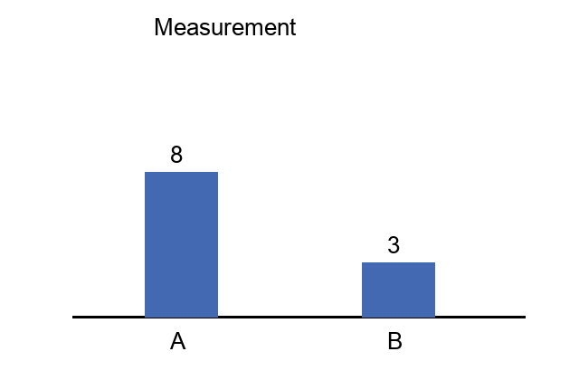
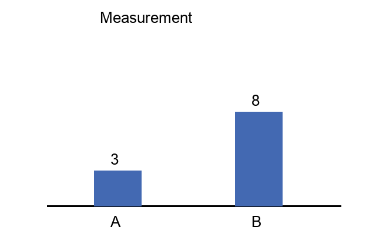
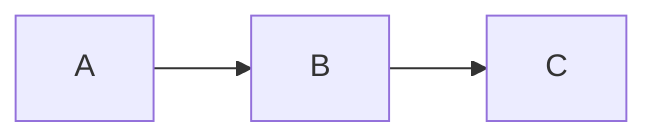
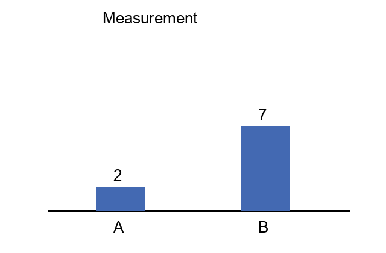
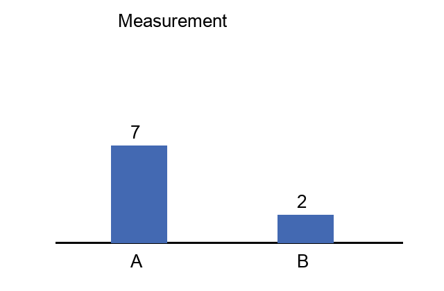
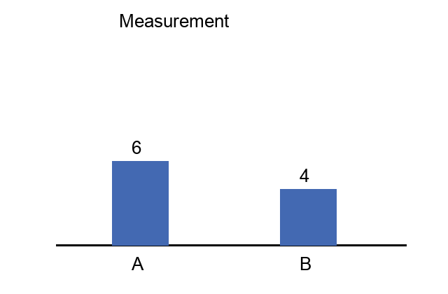
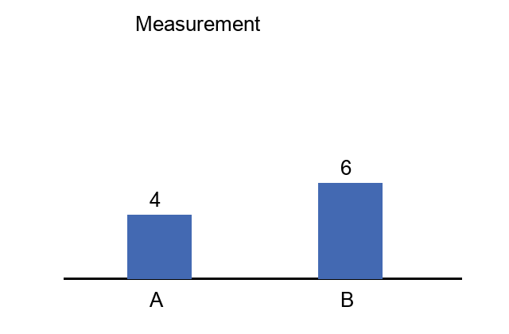

# 前言（无题单元）

## 阅读方法
正文可以有任意内容。这里没有题目。

# U0 附加说明（无题单元）

## 注意事项
不为这个单元创造题目。

# U1 表达式与逻辑

## 教学正文
BODY_SENTINEL_U1_MUST_NOT_ENTER_QUESTIONS

### 正文三级标题
讲解内容不参加本轮模型输入。

#### 正文四级标题
任意段落。

```markdown
# 代码里的伪单元
## meta question
### 伪题目
```

~~~~python
print("## meta question")
~~~~

## meta question

### U1Q1 · 固定测评题

#### 题型
single_choice

#### 题干
Python 表达式 `3 * 2 + 1` 的值是多少？

#### 选项

##### A
7

##### B
9

##### C
6

#### 答案
A

#### 解答
先乘后加，3×2+1=7。

### U1Q2 · 固定测评题

#### 题型
single_choice

#### 题干
Python 表达式 `not (True and False)` 的结果是什么？

#### 选项

##### A
False

##### B
True

#### 答案
B

#### 解答
括号内为 False，取反为 True。

### U1Q3 · 固定测评题

#### 题型
fill_blank

#### 题干
`len("abc")` 的结果为 {{b1}}。

#### 答案
```json
{
  "b1": {
    "grading": "exact",
    "answers": [
      "3"
    ]
  }
}
```

#### 解答
abc 由三个字符组成。

### U1Q4 · 固定测评题

#### 题型
short_answer

#### 题干
解释 Python 中 `==` 和 `is` 各比较什么。

#### 答案
== 比较值是否相等；is 比较是否为同一对象。

#### 解答
== 比较值是否相等；is 比较对象身份。

### U1Q5 · 固定测评题

#### 题型
short_answer

#### 题干
分别说明 Python 的 and 与 or 在什么情况下短路。

#### 答案
and 左侧为假时短路；or 左侧为真时短路。

#### 解答
and 左边为假时不再计算右边；or 左边为真时不再计算右边。


# U2 循环与契约

## 教学正文
BODY_SENTINEL_U2_MUST_NOT_ENTER_QUESTIONS

### 正文三级标题
讲解内容不参加本轮模型输入。

#### 正文四级标题
任意段落。

```markdown
# 代码里的伪单元
## meta question
### 伪题目
```

~~~~python
print("## meta question")
~~~~

## meta question

### U2Q1 · 固定测评题

#### 题型
single_choice

#### 题干
`list(range(1, 4))` 是什么？

#### 选项

##### A
[1,2,3,4]

##### B
[1,2,3]

##### C
[0,1,2,3]

#### 答案
B

#### 解答
range 的停止边界不包含在结果中。

### U2Q2 · 固定测评题

#### 题型
fill_blank

#### 题干
下面代码输出 {{b1}}。

```python
s = 0
for x in [1, 2, 3]:
    s += x
print(s)
```

#### 答案
```json
{
  "b1": {
    "grading": "exact",
    "answers": [
      "6"
    ]
  }
}
```

#### 解答
逐个累加得到 6。

### U2Q3 · 固定测评题

#### 题型
fill_blank

#### 题干
补全说明：循环不变量应在 {{b1}}。

#### 答案
```json
{
  "b1": {
    "grading": "semantic",
    "answers": [
      "循环开始前成立，并且每次迭代都保持成立"
    ]
  }
}
```

#### 解答
需要初始化成立及迭代保持。

### U2Q4 · 固定测评题

#### 题型
short_answer

#### 题干
为什么检查循环不变量时要分别检查初始化和保持？

#### 答案
初始化保证首次迭代前成立；保持保证每一步从成立推出下一步仍成立。

#### 解答
初始化保证首次迭代前成立；保持保证每次迭代后仍成立。

### U2Q5 · 固定测评题

#### 题型
short_answer

#### 题干
函数只接受非空数字列表并返回平均数。输入空列表时，应如何处理以及为什么？

#### 答案
应明确拒绝空列表或抛出异常；因为长度为零，直接求平均会除以零。

#### 解答
明确拒绝空列表或抛出异常；说明长度为零导致除以零。


# U3 容器与引用

## 教学正文
BODY_SENTINEL_U3_MUST_NOT_ENTER_QUESTIONS

### 正文三级标题
讲解内容不参加本轮模型输入。

#### 正文四级标题
任意段落。

```markdown
# 代码里的伪单元
## meta question
### 伪题目
```

~~~~python
print("## meta question")
~~~~

## meta question

### U3Q1 · 固定测评题

#### 题型
single_choice

#### 题干
执行 `a=[1]; b=a; b.append(2)` 后，a 是什么？

#### 选项

##### A
[1]

##### B
[1,2]

#### 答案
B

#### 解答
a 与 b 引用同一列表，原地追加改变该对象。

### U3Q2 · 固定测评题

#### 题型
single_choice

#### 题干
栈的基本取出顺序是什么？

#### 选项

##### A
先进先出

##### B
后进先出

#### 答案
B

#### 解答
栈取出最近压入的元素。

### U3Q3 · 固定测评题

#### 题型
fill_blank

#### 题干
`len({1, 1, 2})` 为 {{b1}}。

#### 答案
```json
{
  "b1": {
    "grading": "exact",
    "answers": [
      "2"
    ]
  }
}
```

#### 解答
集合中重复的 1 只保留一次。

### U3Q4 · 固定测评题

#### 题型
short_answer

#### 题干
解释 `b = a` 与 `b = a.copy()` 对列表的差别；只讨论顶层列表对象。

#### 答案
b=a 共享同一个顶层列表；b=a.copy() 创建新的顶层列表。

#### 解答
b=a 共享顶层列表对象；a.copy 创建新的顶层列表对象。

### U3Q5 · 固定测评题

#### 题型
short_answer

#### 题干
说明队列的 FIFO 含义，并说出最先放入 A、再放入 B 时先取出谁。

#### 答案
FIFO 是先进先出；先取出 A。

#### 解答
FIFO 是先进先出；本例 A 先取出。


# U4 算法与推理

## 教学正文
BODY_SENTINEL_U4_MUST_NOT_ENTER_QUESTIONS

### 正文三级标题
讲解内容不参加本轮模型输入。

#### 正文四级标题
任意段落。

```markdown
# 代码里的伪单元
## meta question
### 伪题目
```

~~~~python
print("## meta question")
~~~~

## meta question

### U4Q1 · 固定测评题

#### 题型
single_choice

#### 题干
二分查找通常要求输入满足什么条件？

#### 选项

##### A
已排序

##### B
长度一定是偶数

#### 答案
A

#### 解答
有序性使比较中点后能够排除一半搜索区间。

### U4Q2 · 固定测评题

#### 题型
fill_blank

#### 题干
二分查找比较中点后可以丢弃一半候选，因为 {{b1}}。

#### 答案
```json
{
  "b1": {
    "grading": "semantic",
    "answers": [
      "数组已排序，目标不可能出现在被排除的那一半"
    ]
  }
}
```

#### 解答
利用有序性排除不可能包含目标的一半。

### U4Q3 · 固定测评题

#### 题型
fill_blank

#### 题干
一个函数有副作用，指它 {{b1}}。

#### 答案
```json
{
  "b1": {
    "grading": "semantic",
    "answers": [
      "除了返回值以外，还改变外部可观察状态"
    ]
  }
}
```

#### 解答
区别返回计算结果与改变外部状态。

### U4Q4 · 固定测评题

#### 题型
short_answer

#### 题干
说明二分查找为什么是 O(log n)：要说清规模如何变化和次数如何增长。

#### 答案
每次比较把剩余候选规模约减半；需要约 log2(n) 次使规模降到 1。

#### 解答
每步候选规模约减半；迭代次数随 log n 增长。

### U4Q5 · 固定测评题

#### 题型
short_answer

#### 题干
为什么测试边界输入还不能证明程序对所有输入都正确？

#### 答案
边界测试只能覆盖选定的有限样例；未测试的输入仍可能触发错误。

#### 解答
测试只覆盖选定样例；未测试输入仍可能出错。


# U5 有向图与数量比较

## 教学正文
BODY_SENTINEL_U5_MUST_NOT_ENTER_QUESTIONS

### 正文三级标题
讲解内容不参加本轮模型输入。

#### 正文四级标题
任意段落。

```markdown
# 代码里的伪单元
## meta question
### 伪题目
```

~~~~python
print("## meta question")
~~~~

## meta question

### U5Q1 · 固定测评题

#### 题型
single_choice

#### 题干
根据图中的数值，哪一列更高？



#### 选项

##### A
A 列

##### B
B 列

#### 答案
A

#### 解答
A 为 8，B 为 3，A 更高。

### U5Q2 · 固定测评题

#### 题型
single_choice

#### 题干
根据图中的数值，哪一列更高？



#### 选项

##### A
A 列

##### B
B 列

#### 答案
B

#### 解答
A 为 3，B 为 8，B 更高。

### U5Q3 · 固定测评题

#### 题型
fill_blank

#### 题干
图中从 A 到 C 是否可达，依据是什么？ {{b1}}



#### 答案
```json
{
  "b1": {
    "grading": "semantic",
    "answers": [
      "可以，因为存在 A→B→C 的有向路径"
    ]
  }
}
```

#### 解答
箭头方向依次为 A 到 B、B 到 C，串联即可到达。

### U5Q4 · 固定测评题

#### 题型
short_answer

#### 题干
读图给出 A、B 的数值，并计算 B−A。



#### 答案
A=2，B=7；B−A=5。

#### 解答
A=2 且 B=7；B−A=5。

### U5Q5 · 固定测评题

#### 题型
short_answer

#### 题干
读图给出 A、B 的数值，并计算 B−A。



#### 答案
A=7，B=2；B−A=-5。

#### 解答
A=7 且 B=2；B−A=-5。


# U6 图表与统计

## 教学正文
BODY_SENTINEL_U6_MUST_NOT_ENTER_QUESTIONS

### 正文三级标题
讲解内容不参加本轮模型输入。

#### 正文四级标题
任意段落。

```markdown
# 代码里的伪单元
## meta question
### 伪题目
```

~~~~python
print("## meta question")
~~~~

## meta question

### U6Q1 · 固定测评题

#### 题型
single_choice

#### 题干
图中 A 占 A+B 总量的比例是多少？



#### 选项

##### A
60%

##### B
40%

#### 答案
A

#### 解答
6/(6+4)=60%。

### U6Q2 · 固定测评题

#### 题型
single_choice

#### 题干
图中 A 占 A+B 总量的比例是多少？



#### 选项

##### A
60%

##### B
40%

#### 答案
B

#### 解答
4/(4+6)=40%。

### U6Q3 · 固定测评题

#### 题型
fill_blank

#### 题干
数字 2、8、3 排序后的中位数为 {{b1}}。

#### 答案
```json
{
  "b1": {
    "grading": "exact",
    "answers": [
      "3"
    ]
  }
}
```

#### 解答
排序结果为 2、3、8，中间是 3。

### U6Q4 · 固定测评题

#### 题型
short_answer

#### 题干
读图计算两列的算术平均数，并说明哪一列高于平均数。

![[assets/v07.png]]

#### 答案
平均数为 6；B 高于平均数。

#### 解答
平均数为 6；B 高于平均数。

### U6Q5 · 固定测评题

#### 题型
short_answer

#### 题干
读图计算两列的算术平均数，并说明哪一列高于平均数。

![[assets/v08.png]]

#### 答案
平均数为 6；A 高于平均数。

#### 解答
平均数为 6；A 高于平均数。
