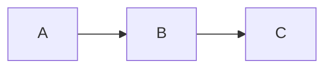

# Markdown 结构边界检查

## 正文
正文内容不得进入题目。

### 不是题目
这只是正文中的三级标题。

## meta question

### 保留全部 Markdown

#### 题型
short_answer

#### 题干
保留公式 $x^2+y^2=z^2$，不要改写其中的转义与空白。

| 项目 | 数值 |
| --- | ---: |
| A | 2 |
| B | 3 |

##### 题干中的五级标题
解释下面的图。

###### 题干中的六级标题
代码里的标题也不能切分题目。

```markdown
# 伪单元
## meta question
### 伪题目
```



#### 答案
A 经 B 到达 C。

#### 解答
沿两条有向边连接即可；公式和表格仅用于内容保真检查。
